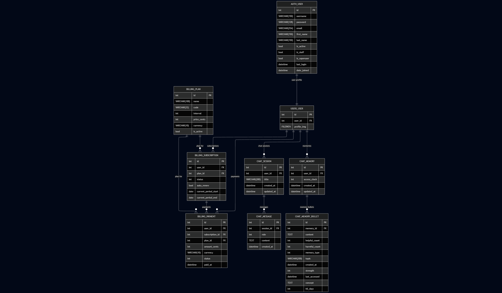

# MIRA

**Memory Incremental Reasoning Architecture**: A Self-Evolving Agentic Framework That Adapts Your Style

## Overview

MIRA is an intelligent agentic framework built with Django that learns and adapts to your personal style through incremental memory and reasoning capabilities.

## Installation

1. Clone the repository:
```bash
git clone https://github.com/Edward-H26/MIRA.git
cd MIRA
```

2. Create and activate a virtual environment:
```bash
python -m venv venv
source venv/bin/activate  # On Windows: venv\Scripts\activate
```

3. Install dependencies:
```bash
pip install -r requirements.txt
```

4. Set up environment variables:
```bash
cp .env.example .env
```

Then edit `.env` and replace `YOUR_KEY` with a freshly generated Django secret key:
```bash
python -c "from django.core.management.utils import get_random_secret_key; print(get_random_secret_key())"
```

5. Run migrations:
```bash
python manage.py migrate
```

6. Start the development server:
```bash
python manage.py runserver
```

## Project Structure

```
.
|-- manage.py              # Django management script
|-- app/                   # Application modules
|   |-- billing/           # Billing and subscription domain
|   |   `-- models: Plan, Subscription, Payment
|   |-- chat/              # Chat sessions, messages, memory
|   |   `-- models: Memory, MemoryBullet, Session, Message
|   |-- memoria/           # App wiring (urls, views)
|   |   `-- models: (none)
|   `-- users/             # User profile models
|       `-- models: User
|-- mira/                  # Project configuration
|   |-- settings/
|   |-- asgi.py
|   |-- urls.py
|   `-- wsgi.py
|-- data/                  # Local data storage
|-- media/                 # User-uploaded files
|-- requirements.txt       # Python dependencies
|-- .env                   # Local environment variables
`-- .env.example           # Environment template
```

## Data Model




## Development

This project uses Django 6.0.1. For development setup, ensure you have Python 3.12+ installed.

## License

This project is developed for INFO 490.
