# MEMORIA: A Self-Evolving Agentic Framework with Transparent, User-Controlled Memory

**Memory Enhanced Multi-modal Orchestration Reasoning Intelligence Architecture**

**By Team MIRA (Team 4)**

Memory Incremental Reasoning Architecture

---

## Abstract

We present Memory Enhanced Multi-modal Orchestration Reasoning Intelligence Architecture (MEMORIA), a web application that enables self-evolving AI assistants with transparent, user-controlled memory. Our system addresses fundamental inefficiencies in current AI interactions, where users constantly have to re-establish context across sessions, resulting in significant token waste and degraded performance. MEMORIA learns user work patterns through procedural learning rather than extensive conversation history, achieving personalization comparable to fine-tuning at approximately 1% of the token cost. Users can visualize, rate, and modify the AI's learned memory, creating unprecedented transparency in personalized AI systems.

---

## Introduction

Large language models have demonstrated remarkable capabilities across diverse tasks, yet they face a fundamental architectural limitation: the absence of persistent, adaptive memory that accumulates knowledge from user interactions over time. Each new conversation session requires users to re-explain their preferences, context, and working style, creating substantial friction in human-AI collaboration. Research demonstrates that LLMs suffer a 39% performance drop in multi-turn conversations as they fail to maintain coherent context over extended interactions.

---

## Key Features

MEMORIA provides four core capabilities that distinguish it from traditional LLM interfaces:

### 1. Transparent Memory Interface
Users maintain complete visibility and control over all stored memories. The system exposes memory contents, relevance scores, and decay states through an intuitive interface, enabling users to inspect, modify, or delete any stored information.

### 2. Procedural Learning Engine
Beyond storing facts, MEMORIA captures procedural knowledge including user preferences, interaction patterns, and task-specific instructions. The system learns how users prefer to accomplish tasks, not just what they know.

### 3. Efficient Memory Retrieval
The LTMBSE-ACE algorithm combines Bloom filter indexing with strength-based scoring to retrieve relevant memories in sublinear time. This enables responsive performance even as memory stores grow large.

### 4. Feedback Integration
User feedback directly influences memory strength and relevance. Positive reinforcement strengthens useful memories while negative signals accelerate decay of unhelpful content, creating a continuously improving system.

---

## Application Functionality

MEMORIA supports three primary operations that enable adaptive, personalized assistance:

### Memory Extraction
The system continuously analyzes conversations to identify and extract memorable content. Facts, preferences, procedures, and episodic experiences are taxonomized and stored with appropriate decay rates based on memory type.

### Context Augmentation
When generating responses, MEMORIA retrieves relevant memories and augments the context without requiring user re-specification. This eliminates redundant information exchange while maintaining natural conversation flow.

### Feedback Integration
Users can rate the helpfulness of retrieved memories, providing direct feedback that adjusts memory strength scores. This creates a reinforcement loop that continuously improves retrieval relevance.

---

## Installation

1. Clone the repository:
```bash
git clone https://github.com/Edward-H26/MIRA.git
cd MIRA
```

2. Create and activate a virtual environment:
```bash
python -m venv venv
source venv/bin/activate  # On Windows: venv\Scripts\activate
```

3. Install dependencies:
```bash
pip install -r requirements.txt
```

4. Set up environment variables:
```bash
cp .env.example .env
```

Then edit `.env` and replace `YOUR_KEY` with a freshly generated Django secret key:
```bash
python -c "from django.core.management.utils import get_random_secret_key; print(get_random_secret_key())"
```

5. AI-model system dependencies (no external binaries required):

The OCR pipeline uses [EasyOCR](https://github.com/JaidedAI/EasyOCR), a pure-PyTorch OCR engine that downloads its English detector and recognizer weights automatically on first use. No `apt-get` or `brew` install is needed. The only OS-level package you may want is a recent CPU build of PyTorch (installed automatically via `requirements.txt`).

6. Configure AI environment variables in `.env`:
```bash
GEMINI_API_KEY="your_gemini_key"   # Optional: enhanced chat-response quality via Gemini 3 Flash
                                   # Leave empty to run fully on the local Qwen3.5-0.8B path.
CHAT_PREFER_LOCAL_LLM="false"      # Set to "true" to force local Qwen even when a Gemini key is set.
```

Memoria runs fully without a Gemini API key. The primary AI stack (semantic search via BGE embeddings, RAG retrieval, EasyOCR, and local chat generation via Qwen3.5-0.8B) is 100% open/local.

7. Run migrations:
```bash
python manage.py migrate
```

8. Start the development server:
```bash
python manage.py runserver
```

### Model Downloads (Automatic)

The following models download automatically on first use. All are public/open weights from Hugging Face or open-source PyTorch checkpoints; nothing is proprietary or paywalled.

| Model | Size | Dim / Params | Purpose | Cache Location |
|---|---|---|---|---|
| `BAAI/bge-base-en-v1.5` | ~436 MB | 768-dim / 110M | Semantic search and RAG embeddings | `llm_test/cache/embedding-models/` |
| `Qwen/Qwen3.5-0.8B` | ~1.6 GB | 0.8B params | Primary local LLM for chat, preprocessing, query rewriting | `llm_test/cache/huggingface-models/` |
| EasyOCR English (detector + recognizer) | ~64 MB | PyTorch CRAFT + CRNN | Receipt and document OCR | `~/.EasyOCR/model/` (EasyOCR default) |

Model weights are excluded from version control via `.gitignore` (`*.bin`, `*.safetensors`, `*.pt`, `*.onnx`, `*.h5`). The application downloads weights locally on first run.

### Optional Services

| Service | Purpose | Required? |
|---|---|---|
| Neo4j | Graph memory synchronization | No (app works without it) |
| Pusher | Real-time notifications | No (app works without it) |
| Google OAuth | Social login | No (email/password login available) |

---

## Accessing AI Features

After starting the server, the following AI-powered features are accessible through the sidebar navigation:

| Feature | URL | AI Models Used |
|---|---|---|
| Chat (New Conversation) | `/home/` | Qwen3.5-0.8B primary (local), Gemini 3 Flash optional enhancement, BGE-base-en-v1.5 (context retrieval) |
| Memory Management | `/chat/memory/` | BGE-base-en-v1.5 (semantic search, 768-dim), ACE tri-channel decay |
| Semantic Search API | `/chat/api/semantic-search/?q=` | BGE-base-en-v1.5 (768-dim cosine similarity) |
| Document Scanning (OCR) | `/chat/document/upload/` | EasyOCR (open-source PyTorch OCR, English) |
| Dashboard | `/chat/dashboard/` | Aggregated AI system metrics |
| Agent Management | `/chat/agents/` | Agent configuration with custom system prompts |
| Agent Marketplace | `/chat/agents/marketplace/` | 10 pre-built agent templates |
| Skill Marketplace | `/chat/skills/marketplace/` | 15 pre-built skill templates across 8 categories |
| Activity Log | `/chat/activity/` | Audit trail of AI operations |
| Analytics | `/chat/analytics/` | Memory distribution and activity charts |

For detailed AI architecture documentation, see [README_AI.md](README_AI.md).

---

## Project Structure

```
.
|-- manage.py                     # Django management script
|-- requirements.txt              # Python dependencies
|-- .env.example                  # Environment variable template
|
|-- app/                          # Application modules
|   |-- billing/                  # Billing and subscription domain (scaffolded)
|   |   `-- models: Plan, Subscription, Payment
|   |
|   |-- chat/                     # Chat sessions, messages, memory, agents, skills
|   |   |-- models/               # Data models
|   |   |   |-- memory.py         # Memory (tri-channel ACE system with planner state)
|   |   |   |-- memory_bullet.py  # MemoryBullet (semantic/episodic/procedural with embeddings)
|   |   |   |-- session.py        # Session (chat sessions with generation lock)
|   |   |   |-- message.py        # Message (user/assistant/system roles)
|   |   |   |-- agent.py          # Agent (custom AI agents with system prompts)
|   |   |   |-- audit_log.py      # AuditLog (event tracking)
|   |   |   |-- notification.py   # Notification (real-time alerts)
|   |   |   `-- session_participant.py # SessionParticipant (agent-session mapping)
|   |   |-- views.py              # 20+ views: chat, memory, dashboard, agents, skills, OCR, analytics
|   |   |-- urls.py               # 35+ URL patterns (page + API routes)
|   |   |-- api.py                # JSON API views (memories, analytics, sessions, semantic search, agents)
|   |   |-- service.py            # Core service functions (sessions, memory, analytics, streaming)
|   |   |-- ace_runtime.py        # ACE (Agentic Context Engineering) runtime orchestrator
|   |   |-- agent_service.py      # Agent CRUD, skill management, mention parsing
|   |   |-- agent_catalog.py      # 10 pre-built agent templates
|   |   |-- skill_catalog.py      # 15 pre-built skill templates across 8 categories
|   |   |-- audit_service.py      # Activity event logging (dual ORM + Neo4j)
|   |   |-- notification_service.py # Notification creation and delivery
|   |   |-- forms.py              # DocumentUploadForm for OCR
|   |   |-- context_processors.py # user_sessions, notifications (sidebar injection)
|   |   |-- signals.py            # Django signals for audit events
|   |   |-- templatetags/         # chat_extras: relative_time filter
|   |   |-- templates/chat/       # 19 templates (chat, memory, dashboard, agents, skills, OCR, analytics)
|   |   `-- static/chat/          # 10 CSS files (per-feature styling)
|   |
|   |-- services/                 # AI and integration services
|   |   |-- classifier.py         # Prompt complexity classifier (8 dimensions + synergy)
|   |   |-- embedding.py          # BAAI/bge-base-en-v1.5 embedding service (768-dim)
|   |   |-- gemini.py             # Gemini 3 Flash streaming API client (optional enhancement)
|   |   |-- local_llm.py          # Qwen3.5-0.8B local LLM (primary chat + preprocessing)
|   |   |-- ocr.py                # EasyOCR pipeline + regex field parsing (receipts, PDFs)
|   |   |-- neo4j_memory.py       # Neo4j graph memory synchronization
|   |   `-- pusher_service.py     # Real-time broadcast service
|   |
|   |-- memoria/                  # Main app wiring (landing, home, 404)
|   |   |-- views.py              # home(), landing(), not_found_view()
|   |   |-- urls.py               # /, /home/
|   |   |-- templates/memoria/    # home.html, landing.html
|   |   `-- static/memoria/       # home.css, landing.css, landing-overrides.css
|   |
|   `-- users/                    # Authentication and user profiles
|       |-- models.py             # User (profile with profile_img)
|       |-- views.py              # login, register, logout, profile, password change
|       |-- urls.py               # /users/login/, /users/register/, /users/profile/, etc.
|       |-- services.py           # authenticate_and_login, register_and_login, create_user_with_profile
|       |-- middleware.py         # Custom middleware
|       |-- templates/users/      # login_form, register_form, profile, password_change_form
|       `-- static/users/         # auth-modal.css, profile.css
|
|-- memoria/                      # Project configuration
|   |-- settings/                 # Environment-specific settings
|   |   |-- base.py               # Shared settings (apps, middleware, templates, db)
|   |   |-- dev.py                 # Dev overrides (DEBUG, ALLOWED_HOSTS)
|   |   |-- prod_render.py        # Render production overrides
|   |   `-- prod_pyany.py         # PythonAnywhere production overrides
|   |-- templates/memoria/        # landing.html (standalone, project-level)
|   |-- urls.py                   # Root URL conf (includes app URLs + handler404)
|   |-- asgi.py
|   `-- wsgi.py
|
|-- templates/                    # Project-level templates
|   `-- base.html                 # Global base template (sidebar, navbar, content blocks)
|
|-- static/                       # Project-level static assets
|   |-- css/
|   |   |-- base.css              # Global layout, sidebar, navbar styles
|   |   `-- main.css              # Compiled/additional styles
|   |-- js/
|   |   `-- main.js               # Sidebar toggle, AJAX handlers, UI interactions
|   `-- images/                   # Logo, avatar, icons, background images
|
|-- docs/                         # Project documentation
|   |-- 01_project_documents/     # Idea description PDF, contribution report
|   |-- 02_wireframes/            # UI wireframes v1, v2, v3 iterations + final PDF
|   |-- 03_data_model/            # ER diagrams (Mermaid source, PNG, SVG)
|   |-- 04_branching_strategy/    # Git branching documentation
|   |-- 05_notes/                 # Weekly progress notes
|   |-- imgs/                     # Screenshot evidence for assignment sections
|   `-- design_choice/            # database_design_choice.md
|
|-- data/                         # Local data storage
|-- llm_test/                    # LLM experiments and model cache
|   |-- cache/                   # Auto-downloaded model weights (gitignored)
|   |-- results/                 # Benchmark results from A6/A7/A8
|   `-- *.ipynb                  # Experiment notebooks
`-- unit_test/                    # Test suite
    |-- mock_data.py              # Shared test data (8 users + admin, 5 plans, 26 bullets, 17 sessions, 49 messages)
    |-- database_unit_test.py     # Database relationship and constraint tests
    `-- feature_unit_test.py      # Service layer and API payload tests
```

---

## Data Model

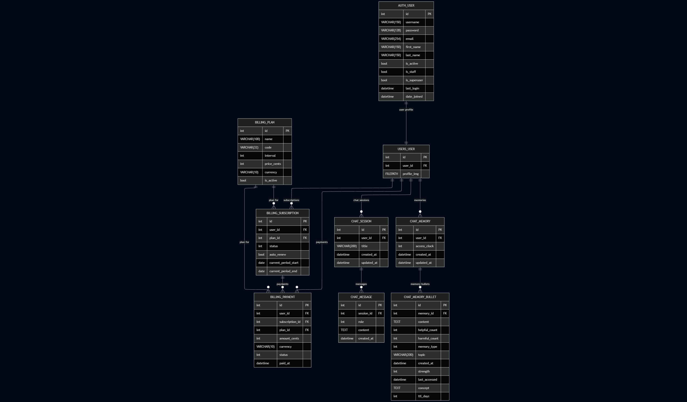

---

## Team

**Authors:**

- **Qiran Hu** (First Author, Algorithm Originator)
- **Amy Bisalputra** (Equal Contribution, Application Development)
- **Ke Ding** (Equal Contribution, Application Development)
- **Min Kim** (Equal Contribution, Application Development)
- **Kewen Xia** (Equal Contribution, Application Development)

---

## Acknowledgements

The LTMBSE-ACE algorithm implemented in MEMORIA derives from foundational work on the NOODEIA project conducted at SALT Lab.

---

## UI and Styling

MEMORIA features a polished, production-grade interface built with vanilla CSS and no frontend build tools. The design uses frosted glass effects (`backdrop-filter: blur`), gradient backgrounds with layered radial gradients, the Inter typeface for clean typography, and custom SVG icons throughout. A collapsible sidebar modeled after ChatGPT, Claude, and Gemini provides 5 navigation items: Home, Memory, Analytics, New Chat, and Search. Static files use a hybrid organization with project-level shared assets and app-level feature-specific styles. Cache busting in development appends Unix timestamps via ``.

Screenshots:

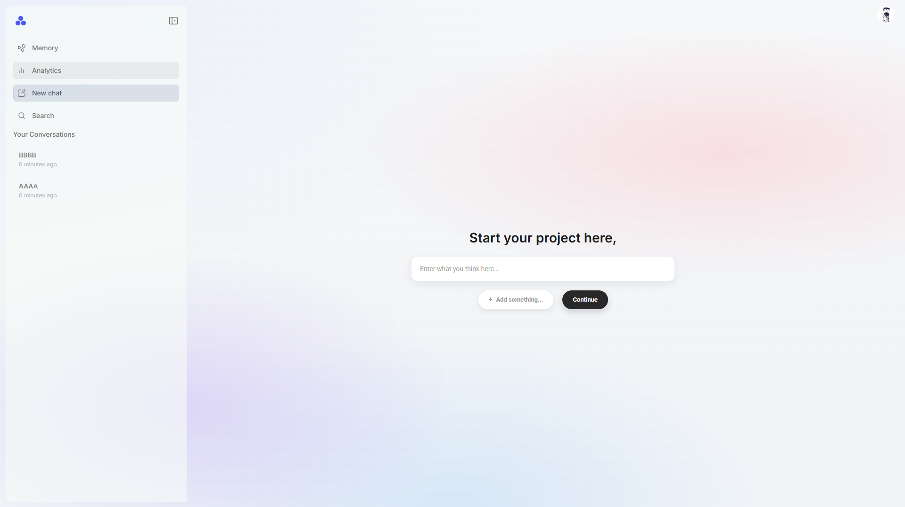
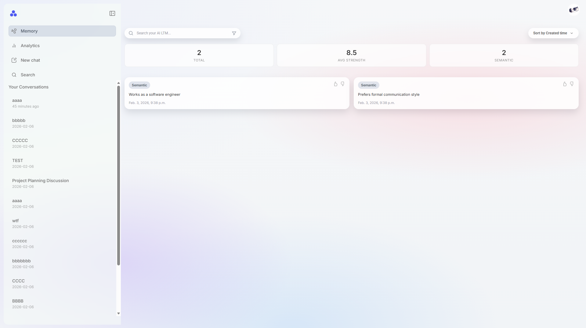
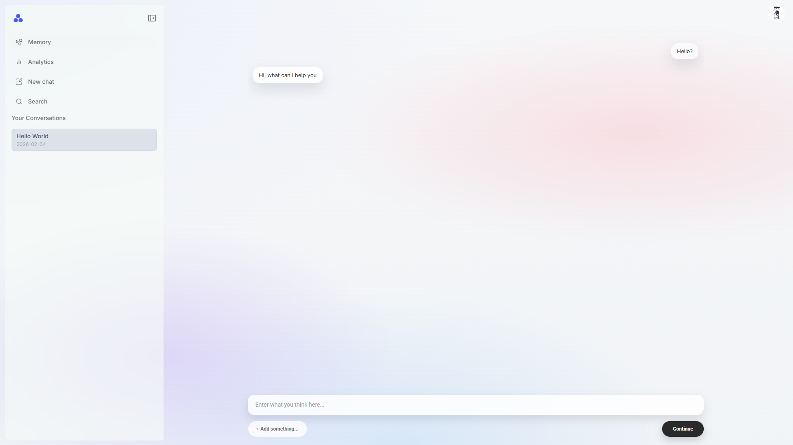
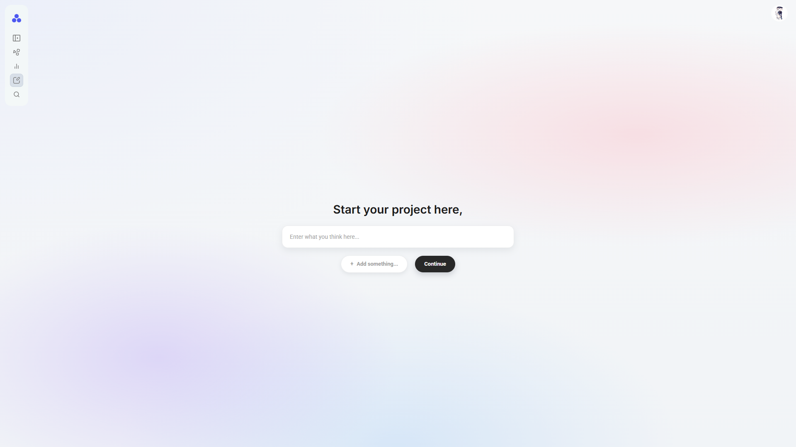

### AI Feature Screenshots

The following screenshots are captured from the running Django application. All paths resolve to files currently in the repository.

| Feature | Screenshot |
|---|---|
| Home (with AI-powered chat input) | 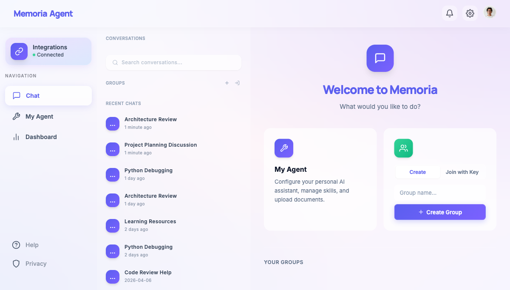 |
| Dashboard (aggregated AI metrics) | 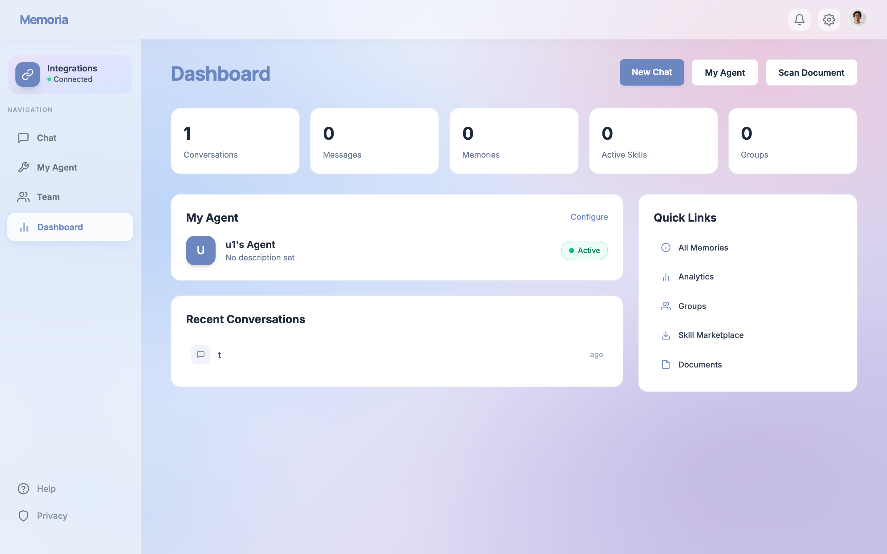 |
| Memory Management (BGE-powered semantic search) | 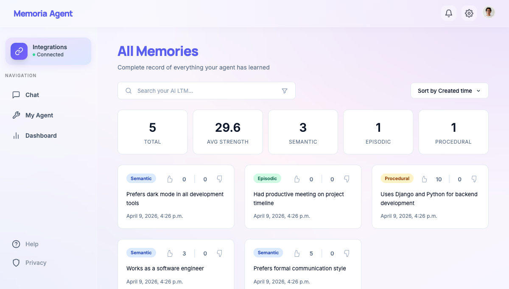 |
| Analytics (AI usage over time) | 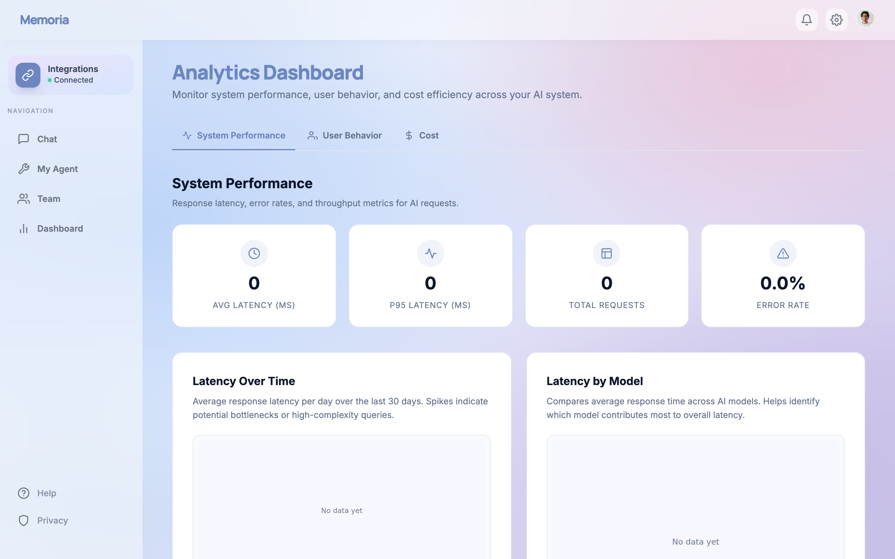 |
| Agent Detail (custom system prompt) | 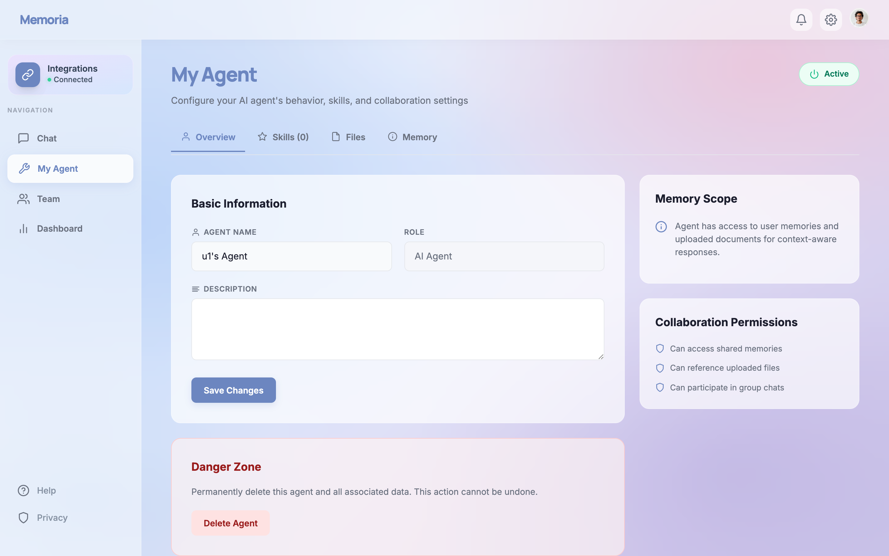 |
| Groups (multi-user agent workspaces) | 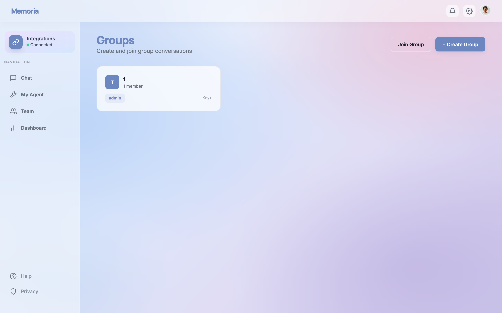 |
| Activity Log (audit trail of AI operations) | 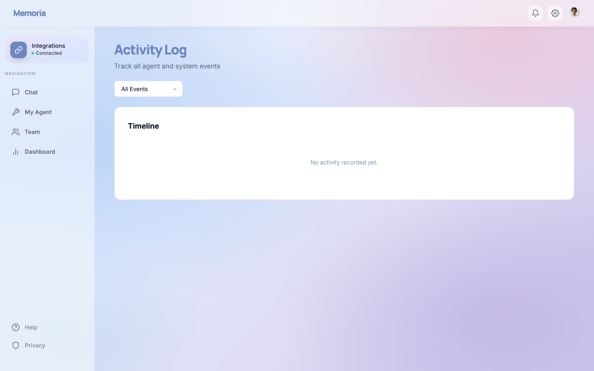 |
| Skill Marketplace (pre-built AI skills) | 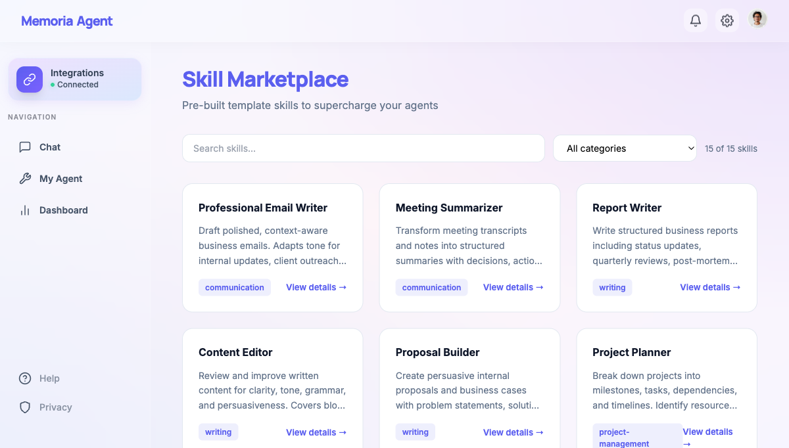 |
| Conversation (streaming AI response) | 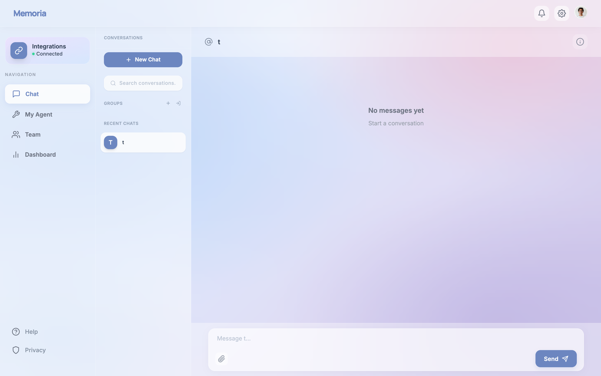 |
| Documents (OCR ingestion + RAG indexing) | 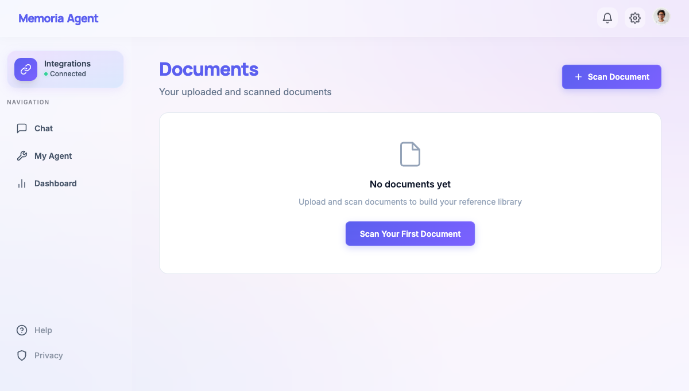 |
| Agent Skills (skill binding to agents) | 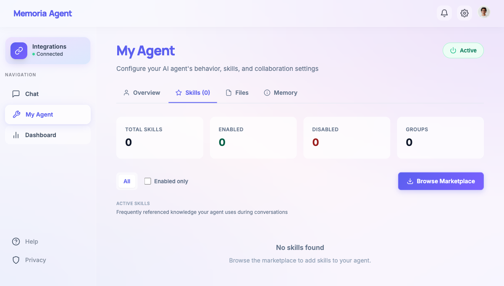 |

Sample OCR input used in evaluation: `docs/screenshots/test_receipt.png`.

---

## URL Note

The root URL (`/`) resolves to the landing page, and authenticated workflow continues through `/home/`, `/chat/memory/`, `/chat/c/<session_id>/`, and `/chat/m/<memory_id>/`.  
Detail navigation uses model-driven URLs via `get_absolute_url()` on `Session` and `Memory`, so templates link objects directly without hard-coded paths.  
This keeps URL routing maintainable and ensures list-to-detail navigation stays consistent across sidebar conversations, memory cards, and API payloads.

---

## Analytics Dashboard

The analytics page at `/chat/analytics/` displays three server-side charts generated with Matplotlib:

1. **Memory Type Distribution** (Pie): Balance of Semantic, Episodic, and Procedural memories
2. **Memory Strength Distribution** (Bar): Count of memories across strength ranges
3. **Conversation Activity** (Line): Sessions created per day over the last 30 days

Each chart is served as a standalone PNG image at its own URL endpoint (e.g., `/chat/analytics/memory-type.png`).

For the Analytics Dashboard design and implementation (26 widgets across System Performance, User Behavior, and Cost), see [`docs/08_ai_architecture/A10_ANALYTICS_DASHBOARD.md`](docs/08_ai_architecture/A10_ANALYTICS_DASHBOARD.md) and the rendered [PDF](docs/08_ai_architecture/A10_ANALYTICS_DASHBOARD.pdf). Live dashboard at `https://mira-ydqq.onrender.com/chat/analytics/` with seeded test login `mohitg2 / uiuc12345`.

---

## API Endpoints

MEMORIA exposes JSON APIs for internal frontend use and future client integration:

Detailed API documentation:
- [API Overview](docs/06_api/api_overview.md)

| Endpoint | Method | Auth | Description | Filters |
|---|---|---|---|---|
| `/chat/api/memories/` | GET | Yes | Memory bullets | `?q=`, `?type=`, `?topic=`, `?strength_min=` |
| `/chat/api/analytics/` | GET | Yes | Aggregated analytics summary | None |
| `/chat/api/sessions/` | GET | Yes | User sessions | `?q=` |
| `/chat/api/sessions/<id>/messages/` | GET | Yes | Messages for a session | `?role=` |
| `/chat/api/active-users/` | GET | No | Daily active user counts (public) | None |
| `/chat/api/active-users/holidays/` | GET | No | Daily activity with holiday annotations (public) | `?country=` |

The sessions API powers the sidebar search modal (Ctrl+K). The public active-users endpoints provide chart-ready data consumed by Vega-Lite visualizations and are accessible without authentication for cross-site integration.

---

## Week 4 Features

Features added in Week 4:
- **Sidebar navigation** with 5 items (Home, Memory, Analytics, New Chat, Search)
- **Conversation search modal** triggered by Ctrl+K / Cmd+K
- **Conversation rename and delete** with backend persistence
- **Memory detail page** at `/chat/m/<id>/` showing all bullets for a memory record
- **POST search** on home page for private conversation content search
- **ORM aggregations** (Count, grouped Count, Avg, Max, Min, Sum) displayed in stat cards
- **Analytics dashboard** with 3 Matplotlib charts using BytesIO
- **MemoryListView** (ListView CBV) handling both GET and POST
- **4 JSON API endpoints** (2 FBV, 2 CBV)

---

## Testing

MEMORIA includes a comprehensive test suite covering database integrity, service layer functions, API payloads, and chart generation.

### Test Files

| File | Purpose | Tests |
|---|---|---|
| `unit_test/mock_data.py` | Shared test data module | 8 test users + admin seeding, 5 plans, 26 memory bullets, 12 sessions + 5 admin sessions, 36 + 13 messages |
| `unit_test/database_unit_test.py` | Database relationships and constraints | FK chains, uniqueness, on_delete (CASCADE, PROTECT, SET_NULL), model methods |
| `unit_test/feature_unit_test.py` | Service layer and API testing | 67 tests across 8 groups (users, sessions, memory, analytics, charts, API, models, edge cases) |

### Running Tests

All test and data scripts must be run from the **project root**:

```bash
# Seed the database with mock data
python unit_test/mock_data.py

# Run tests
python unit_test/database_unit_test.py          # Run all database tests
python unit_test/feature_unit_test.py           # Run all feature tests
python unit_test/feature_unit_test.py --test-api    # Run API payload tests only
python unit_test/feature_unit_test.py --test-charts # Run chart generation tests only
```

### Mock Data Coverage

The shared mock data module provides realistic test personas covering power users, free tier users, edge cases (empty data, max-length fields, special characters), and deletion targets. Memory bullet strengths span all 5 histogram buckets (0-20, 21-40, 41-60, 61-80, 81-100), and all 3 MemoryType values (Semantic, Episodic, Procedural) are distributed across users. Subscription and payment records cover all status enums (ACTIVE, EXPIRED, INCOMPLETE, SUCCEEDED, FAILED, PENDING, CANCELLED).

In addition to the 8 test users, the script seeds demo data for the existing admin account (`tester`). This includes 5 sessions (backdated across different days), 13 messages, 1 memory record, and 5 memory bullets so the admin user sees realistic content in the sidebar, memory page, and analytics charts immediately after seeding. All sessions (both test user and admin) are backdated to different days within the last 30 days to produce a realistic Conversation Activity chart, with at least one day containing 2 sessions.

---

## Updates

- **Comprehensive test infrastructure** with shared mock data module
- **Database unit tests** expanded with model method validation, extended uniqueness checks, and failure counter with exit codes
- **Feature unit tests** covering all 20 service functions, 5 user service functions, 4 API payload builders, and 3 chart generators
- **Edge case testing** for empty users, boundary values, and non-numeric filter parameters
- **Public daily active users API** at `/chat/api/active-users/` with gap-filled date ranges for continuous charting
- **External Holiday API integration** (Nager.at) at `/chat/api/active-users/holidays/?country=` with error handling, country validation, and comparative analytics (avg users on holidays vs non-holidays)
- **Vega-Lite bar chart** (daily active users) at `/chat/charts/active-users/` and **line chart** (daily messages) at `/chat/charts/messages/`, both using `data.url` from the public API
- **CSV and JSON export** for sessions and memory bullets with timestamped filenames (`sessions_YYYY-MM-DD_HH-MM.csv`), metadata headers (`generated_at`, `record_count`), and `Content-Disposition` for browser download
- **Analytics reports page** at `/chat/analytics/` with grouped summaries (sessions by day/week/month, memories by type/topic/month), totals lines, `` handling, and download buttons with format picker (CSV/JSON)
- **UUID-based avatar routing** at `/users/avatar/<uuid>/` with authentication, authorization (owner or staff), file validation (PNG/JPG only), and fallback to default avatar
- **Static files setup** with `STATIC_URL`, `STATICFILES_DIRS`, `STATIC_ROOT` in `settings/base.py`; `` and `` in base template; cache busting with ``
- **Mock data redesigned** for realistic date coverage with 50 dynamic daily conversations across 25 days, weekday/weekend patterns, and natural activity spikes
- **URL organization** separated into `page_urlpatterns` and `api_urlpatterns` in chat URLs
- **Holiday service unit tests** with mocked API responses for valid/invalid country codes and network errors
- **Google OAuth integration** via django-allauth with "Continue with Google" button on login and signup modals, avatar sync from Google profile, and display name extraction
- **Internal authentication** with custom login/signup modal pages, logout via POST form, and `LOGIN_URL`, `LOGIN_REDIRECT_URL`, `LOGOUT_REDIRECT_URL` configured in settings
- **Auth-dependent navigation** in base.html: Memory, Analytics, New Chat, and Search hidden for unauthenticated users; avatar menu only visible when logged in
- **CORS headers** configured via django-cors-headers allowing `vega.github.io` to access public API endpoints for Vega-Lite editor integration
- **Environment-specific settings** refactored into `dev.py`, `prod_render.py`, and `prod_pyany.py` with HTTPS enforcement, secure cookies, and WhiteNoise static file serving
- **ALLOWED_HOSTS format fix** for Render production (removed erroneous `https://` scheme prefix)
- **Duplicate middleware removal** (CommonMiddleware was listed twice in MIDDLEWARE)
- **Three alternative API use demonstrations** in `docs/07_api_demos/` with Python scripts for aggregation, pandas statistical analysis, and CSV export for Excel/Google Sheets
- **Vega-Lite submission spec** in `docs/07_api_demos/vega_lite_spec.txt` using absolute production URL for the Vega-Lite editor

---

## Development

This project uses Django 6.0.1. For development setup, ensure you have Python 3.12+ installed.

---

## License

All rights reserved.
