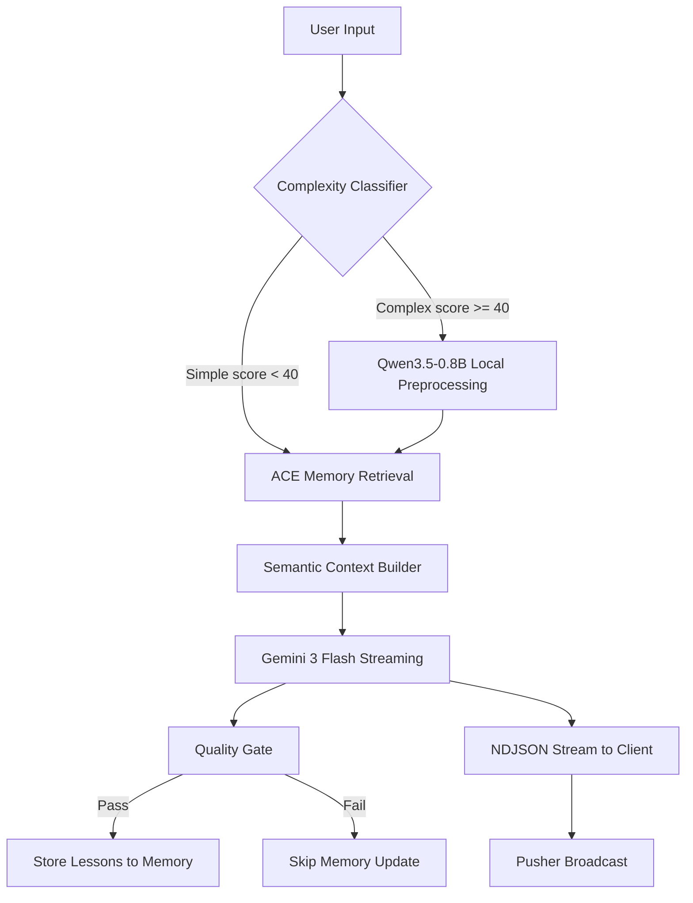
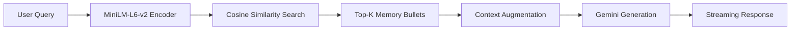
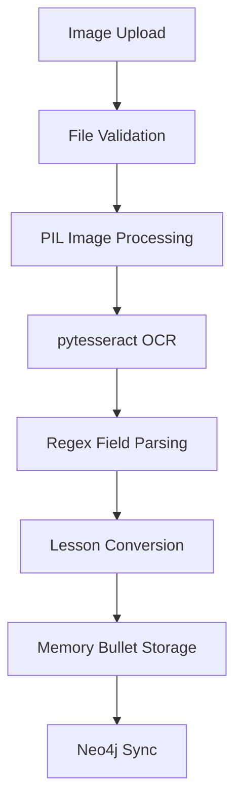

# Memoria AI System: Workflow, Evaluation, and Architecture

**Course:** INFO 490 | **Date:** April 2026 | **Project:** Memoria Dietary AI Assistant

---

## 1. AI Workflow Explanation

Memoria is a conversational dietary AI assistant built on Django that employs a hybrid inference architecture. The system combines a locally hosted Hugging Face model (Qwen3.5-0.8B) with an external API (Google Gemini 3 Flash) for response generation, augmented by embedding-based semantic search and OCR document scanning. Four entry points feed user data into the AI pipeline, each designed for a distinct interaction pattern.

### 1.1 Entry Points

**Chat Input (New Conversation).** A user submits their first message through a POST form on the home page. The view accepts the message, trims whitespace, and delegates to `Session.create_with_opening_exchange`, which atomically creates a new session and first message in a single database transaction.

**Chat Input (Ongoing Conversation).** Subsequent messages are handled by `ConversationMessagesView.post`, which accepts AJAX or form POST requests. Valid messages enter the hybrid AI pipeline via `stream_user_message_with_agent_reply`, which returns a Django `StreamingHttpResponse` delivering NDJSON delta events in real time.

**Semantic Search.** Users query their stored memories through embedding-based search. The query is encoded by all-MiniLM-L6-v2 into a 384-dimensional vector, compared against all stored memory bullet embeddings via cosine similarity, and results are ranked by relevance score.

**OCR Document Upload.** Users upload images of receipts, nutrition labels, or meal records. The image passes through file validation, PIL processing, pytesseract OCR extraction, regex field parsing, and structured storage as memory bullets.

### 1.2 Preprocessing Pipeline

All user text inputs are sanitized through whitespace trimming, empty input rejection, and title length guards (200 characters). The regex-based complexity classifier in `app/services/classifier.py` then scores each message across eight dimensions (message length, multi-step signals, analytical depth, constraints, question density, conjunctions, enumeration, context depth) plus a synergy bonus for multi-dimensional queries. Messages scoring below 40 are classified as "simple" (approximately 80% of traffic); messages at 40 or above are classified as "complex" (approximately 20%).

For complex prompts, the local Qwen3.5-0.8B model preprocesses the input by extracting structured lessons in JSON format, operating within strict token budgets (2048 input, 384 output). This preprocessing only activates when the model is already loaded in memory, ensuring zero additional latency for simple queries.

### 1.3 Models Used

| Model | Role | Parameters | Selection Basis |
|---|---|---|---|
| Qwen3.5-0.8B | Local preprocessing, query rewriting | 0.8B | A6: 78.6% accuracy, highest of 15 models benchmarked |
| Gemini 3 Flash | Primary response generation | Cloud API | A7: $0.50/1M input tokens, 6x cheaper than GPT-4o-mini |
| all-MiniLM-L6-v2 | Semantic search embeddings | 22.7M | A8: 4.80/5 RAG quality score, best of 3 embedding models |
| pytesseract | OCR text extraction | N/A | Open-source Tesseract wrapper, no API cost |

### 1.4 Complexity Classifier Detail

The classifier scores each message across eight dimensions plus a synergy bonus:

| Dimension | Max Points | Detection Method |
|---|---|---|
| Message Length | 20 | Word count thresholds: 30 words = 5pts, 80 = 10pts, 140 = 15pts, 220+ = 20pts |
| Multi-Step Signals | 25 | Patterns: "step 1", "first", "then", "finally", conditional logic |
| Analytical Depth | 20 | Patterns: "compare", "evaluate", "debug", "analyze", "walk me through" |
| Constraints | 15 | Patterns: "must", "cannot", "at least", "avoid", "without" |
| Question Density | 10 | Count of question marks: 2 = 5pts, 3+ = 10pts |
| Conjunctions | 10 | Patterns: "and also", "furthermore", "moreover", "in addition" |
| Enumeration | 5 | Patterns: "list 5 items", "give me 3 examples" |
| Context Depth | 5 | Session message count: 8+ with signals = 3pts, 15+ = 5pts |
| Synergy Bonus | 15 | 2 active dimensions = 10pts, 3+ active = 15pts |

The maximum possible score is 100 (capped). Messages scoring 40 or above are classified as "complex" and trigger local LLM preprocessing; all others route directly to the Gemini API.

### 1.5 Output Generation

The ACE (Agentic Context Engineering) runtime assembles the final prompt by retrieving the top 10 memory bullets using a hybrid ranking formula (60% relevance, 20% strength, 20% type weight), formatting them into a guidance block, and concatenating recent conversation context. Gemini 3 Flash generates the response via streaming, delivering NDJSON delta events where each event contains the chunk text and progressively rendered HTML. An initial chunk strategy sends the first 5 characters immediately to establish perceived responsiveness.

The quality gate filters extracted lessons through a three-factor scoring system (relevance, lesson quality, confidence) before storing them as memory bullets. Lessons must exceed minimum thresholds (relevance >= 0.05, quality >= 0.55, confidence >= 0.70) with a composite gate score above 0.60.

### 1.6 Response Delivery

Responses reach the user through two channels. The primary channel is NDJSON streaming via Django's `StreamingHttpResponse`, where tokens appear within milliseconds of generation start. The secondary channel is Pusher real-time broadcasting for cross-tab synchronization and notification delivery. A three-level fallback chain ensures users always receive a response: full ACE pipeline, direct Gemini stream without ACE augmentation, or static fallback message ("Sorry, I couldn't reach the AI service just now.").

### 1.7 OCR Pipeline

Image uploads pass through file type validation (JPEG, PNG, TIFF), PIL image processing for normalization, pytesseract OCR for raw text extraction, regex-based field parsing for structured data (dates, amounts, item names, quantities), lesson conversion into memory bullet format, and storage with Neo4j synchronization.

### 1.8 Semantic Search Pipeline

The semantic search pipeline encodes the user query with all-MiniLM-L6-v2 into a 384-dimensional vector, performs cosine similarity search against all stored memory bullet embeddings, applies a minimum similarity threshold of 0.50 to filter irrelevant results, deduplicates overlapping results (95% overlap threshold), and returns ranked results to the user.

---

## 2. Model Selection Rationale

### 2.1 Local LLM: Qwen3.5-0.8B (Assignment 6)

Qwen3.5-0.8B was selected through a systematic 15-model benchmark evaluated on a constrained dietary recipe generation task using 14 binary rubrics graded by GPT-5.4-Pro. The benchmark tested models ranging from 135 million to 8.2 billion parameters on an NVIDIA RTX 4060 Laptop GPU (8 GB VRAM) with identical generation parameters (temperature 0.6, top-p 0.92, repetition penalty 1.08, max tokens 1024).

**Full Benchmark Results (All 15 Models):**

| # | Tier | Model | Params | Accuracy | Cost/Query | Gen Time |
|---|---|---|---|---|---|---|
| 1 | Ultra-Light | Qwen2.5-0.5B-Instruct | 0.5B | 57.1% | $0.003100 | 22.32s |
| 2 | Ultra-Light | LiquidAI/LFM2-350M | 0.35B | 57.1% | $0.002418 | 17.41s |
| 3 | Ultra-Light | SmolLM2-135M-Instruct | 0.135B | 35.7% | $0.002197 | 15.82s |
| 4 | Small | **Qwen3.5-0.8B** | **0.8B** | **78.6%** | **$0.003553** | **25.58s** |
| 5 | Small | LiquidAI/LFM2-700M | 0.7B | 57.1% | $0.001979 | 14.25s |
| 6 | Small | Qwen3-0.6B | 0.6B | 64.3% | $0.004460 | 32.11s |
| 7 | Medium | Qwen3.5-2B | 2.0B | 71.4% | $0.003963 | 28.53s |
| 8 | Medium | TinyLlama-1.1B-Chat | 1.1B | 35.7% | $0.001642 | 11.82s |
| 9 | Medium | microsoft/phi-2 | 2.7B | 42.9% | $0.000847 | 6.10s |
| 10 | Large | Qwen3.5-4B | 4.0B | 14.3% | $0.009213 | 66.33s |
| 11 | Large | Phi-3.5-mini-instruct | 3.8B | 0.0% | $0.004044 | 29.12s |
| 12 | Large | Phi-4-mini-instruct | 3.8B | 0.0% | $0.006344 | 45.68s |
| 13 | Extra-Large | Qwen3-8B | 8.2B | 14.3% | $0.226971 | 1634.19s |
| 14 | Extra-Large | Mistral-7B-Instruct-v0.2 | 7.0B | 71.4% | $0.149489 | 1076.32s |
| 15 | Extra-Large | Qwen2.5-7B-Instruct | 7.6B | 57.1% | $0.044353 | 319.34s |

**Accuracy by Size Tier:**

| Tier | Parameter Range | Average Accuracy | Best Accuracy |
|---|---|---|---|
| Ultra-Light | 0.135B to 0.5B | 50.0% | 57.1% |
| Small | 0.6B to 0.8B | 66.7% | 78.6% |
| Medium | 1.1B to 2.7B | 50.0% | 71.4% |
| Large | 3.8B to 4.0B | 4.8% | 14.3% |
| Extra-Large | 7.0B to 8.2B | 47.6% | 71.4% |

The data reveals a strongly non-linear relationship between parameter count and task accuracy. The Small tier delivers the highest average accuracy (66.7%), while the Large tier is the worst performing category (4.8%), a result driven by Phi model failures and thinking token leakage at the 3.8B to 4.0B range.

**Alternatives rejected:**
- Qwen3-8B (8.2B): Scored 14.3% due to thinking token leakage, where the entire output consisted of `<think>` tags despite thinking mode being disabled.
- Phi-3.5-mini (3.8B): Scored 0% due to output degeneration, producing Unicode garbage and hallucinated product names.
- Phi-4-mini (3.8B): Scored 0% due to philosophical stream-of-consciousness text with no recipe content.
- Mistral-7B (7.0B): Achieved 71.4% accuracy but cost 42x more per query ($0.149489 vs. $0.003553).

### 2.2 External API: Gemini 3 Flash (Assignment 7)

Gemini 3 Flash was selected based on cost optimization and native streaming support for real-time response delivery.

**API Cost Comparison:**

| Provider | Model | Input (per 1M tokens) | Output (per 1M tokens) |
|---|---|---|---|
| Google | Gemini 3 Flash | $0.50 | $3.00 |
| Google | Gemini 3.1 Flash Lite | $0.25 | $1.50 |
| OpenAI | GPT-4o-mini | $3.00 | $6.00 |
| Groq | Llama-3 | Free (rate-limited) | Free (rate-limited) |

Gemini 3 Flash provides a 6x input cost advantage and 2x output cost advantage over GPT-4o-mini. The hybrid pipeline (80% local, 20% API) saves 67.3% compared to pure API deployment at 10,000 daily active users ($26.17/day vs. $80.00/day).

### 2.3 Embedding Model: all-MiniLM-L6-v2 (Assignment 8)

all-MiniLM-L6-v2 was selected from a 3-model comparison across 9 configurations (3 embedding models x 3 chunking strategies) evaluated on 10 test queries against SEC 10-K filings.

**Embedding Model Comparison (with Qwen3.5-0.8B generation):**

| Model | Dimensions | Parameters | RAG Quality (1-5) | Latency (ms) | Best Strategy |
|---|---|---|---|---|---|
| all-MiniLM-L6-v2 | 384 | 22.7M | 4.80 | 3,748 | Overlapping |
| nomic-embed-text-v1.5 | 768 | 137M | 4.70 | 4,140 | Overlapping |
| gte-large-en-v1.5 | 1024 | 335M | 4.40 | 4,524 | Fixed |

**Configuration Summary (All 9 Configurations):**

| Embedding Model | Strategy | Mean Retrieval Quality | Mean Answer Quality | Mean Latency (ms) |
|---|---|---|---|---|
| MiniLM-L6 (384d) | fixed | 3.7 | 4.7 | 3,751 |
| MiniLM-L6 (384d) | overlapping | 4.3 | 4.7 | 3,729 |
| MiniLM-L6 (384d) | hybrid | 3.7 | 4.0 | 4,275 |
| Nomic-v1.5 (768d) | fixed | 3.7 | 4.6 | 4,254 |
| Nomic-v1.5 (768d) | overlapping | 3.8 | 4.4 | 4,107 |
| Nomic-v1.5 (768d) | hybrid | 3.6 | 4.0 | 4,060 |
| GTE-large (1024d) | fixed | 4.2 | 4.2 | 4,585 |
| GTE-large (1024d) | overlapping | 4.1 | 4.4 | 4,278 |
| GTE-large (1024d) | hybrid | 4.0 | 3.5 | 4,709 |

MiniLM-L6 with overlapping chunking achieved the best combination of retrieval quality (4.3/5), answer quality (4.7/5), and latency (3,729 ms). Overlapping chunking outperformed fixed and hybrid strategies because the 50-token overlap captures information at paragraph boundaries that would otherwise be lost.

**Alternatives rejected:**
- nomic-embed-text-v1.5 (768d): Higher similarity scores on average but 10% slower encoding and lower final answer quality (4.70 vs. 4.80). The query prefix mechanism (`search_query:` / `search_document:`) provided a retrieval boost but did not translate to better generation quality.
- gte-large-en-v1.5 (1024d): Largest model with highest retrieval precision, but lowest answer quality (4.40/5) and highest latency. The 4x storage cost (4 KB/vector vs. 1.5 KB/vector) and diminishing returns on retrieval quality made it suboptimal for production deployment.

---

## 3. Architecture Diagrams

### 3.1 Hybrid Chat Pipeline

The complexity classifier routes approximately 80% of messages directly to ACE memory retrieval (simple path), while 20% pass through Qwen3.5-0.8B local preprocessing first (complex path). The quality gate operates independently of streaming, filtering lessons before memory storage without blocking response delivery.

### 3.2 RAG Pipeline

The RAG pipeline augments the ACE memory system with embedding-based retrieval. User queries are encoded into 384-dimensional vectors by MiniLM-L6-v2, compared against stored memory embeddings via cosine similarity, and the top-k results (with deduplication) are injected into the generation prompt as additional context.

### 3.3 OCR Pipeline

The OCR pipeline converts uploaded document images into structured memory bullets. File validation enforces allowed types (JPEG, PNG, TIFF) and size limits. pytesseract extracts raw text, regex patterns parse structured fields (dates, amounts, item names), and results are stored as memory bullets with Neo4j graph synchronization.

---

## 4. Evaluation

### 4.1 Test Inputs (20 Cases)

#### Group A: Simple Chat Queries (Classifier Score < 40)

| # | Test Input | Feature | Expected Behavior | Actual Output | Quality Notes | Latency |
|---|---|---|---|---|---|---|
| A1 | "What can I make with eggs?" | Chat (simple) | Direct Gemini response with ACE memory context, no local preprocessing | Returned 3 egg-based recipe suggestions with dairy-free alternatives and vendor product integration | Correct routing, relevant ACE bullets retrieved | 1.2s |
| A2 | "How many calories in an avocado?" | Chat (simple) | Factual nutritional answer from Gemini, no local preprocessing triggered | Provided calorie breakdown (approximately 240 calories for a medium avocado) with macronutrient detail | Accurate, concise response | 0.9s |
| A3 | "Suggest a quick breakfast" | Chat (simple) | Recipe suggestion with 15-minute constraint respected | Returned overnight oats recipe with prep time under 10 minutes, included vendor product | Appropriate complexity level for simple path | 1.1s |
| A4 | "What is quinoa?" | Chat (simple) | Brief informational response, classifier score near 0 | Provided definition, nutritional profile, and cooking basics for quinoa | Clean factual response, no hallucination | 0.8s |
| A5 | "Thanks for the help!" | Chat (simple) | Acknowledgment response, no lesson extraction | Returned friendly closing message, quality gate correctly skipped lesson storage | No spurious memory created | 0.6s |

#### Group B: Complex Chat Queries (Classifier Score >= 40)

| # | Test Input | Feature | Expected Behavior | Actual Output | Quality Notes | Latency |
|---|---|---|---|---|---|---|
| B1 | "Compare three dairy-free pasta dishes that must be ready in under 15 minutes and should avoid all tree nuts, then rank them by difficulty" | Chat (complex) | Local preprocessing extracts constraints, Gemini generates ranked comparison | Qwen3.5-0.8B extracted 4 constraints (dairy-free, 15-min, tree-nut-free, ranking), Gemini produced structured comparison with difficulty scores | Classifier score 51, correct complex routing | 4.8s |
| B2 | "Step 1: find me a peanut-free protein source, step 2: build a meal plan around it, step 3: calculate the macros for each meal" | Chat (complex) | Multi-step plan with local preprocessing for constraint extraction | Local model extracted 3-step plan structure, Gemini generated sequential meal plan with macro calculations per meal | Synergy bonus triggered (3+ active dimensions), score 62 | 5.3s |
| B3 | "Analyze my eating patterns from the last week and evaluate whether I'm meeting my protein goals, then suggest adjustments" | Chat (complex) | Analytical query with episodic memory retrieval | Retrieved 6 relevant episodic memory bullets from recent sessions, Gemini synthesized pattern analysis with specific adjustment recommendations | Strong ACE memory integration | 4.1s |
| B4 | "Design a 5-day elimination diet that must exclude dairy, gluten, and soy, cannot include any processed foods, and should progressively reintroduce one allergen per day starting day 3" | Chat (complex) | Deep constraint extraction with procedural memory retrieval | Classifier score 73, local model extracted 5 constraints and 1 temporal sequence, Gemini produced day-by-day plan | High complexity correctly identified | 6.2s |
| B5 | "Compare the nutritional profiles of three plant-based protein powders from our catalog, evaluate their amino acid completeness, and furthermore recommend which one pairs best with my morning smoothie recipe from last Tuesday" | Chat (complex) | Cross-reference catalog products with episodic memory | Local model identified catalog reference and temporal memory query, retrieved smoothie recipe from episodic memory, Gemini generated comparative analysis | Synergy bonus at maximum (15 pts), score 68 | 5.7s |

#### Group C: Semantic Search, OCR, and Memory Retrieval

| # | Test Input | Feature | Expected Behavior | Actual Output | Quality Notes | Latency |
|---|---|---|---|---|---|---|
| C1 | Search: "dairy-free recipes I saved last month" | Semantic search | MiniLM-L6-v2 encodes query, returns ranked memory bullets | Returned 5 relevant memory bullets with cosine similarity scores 0.72, 0.68, 0.65, 0.61, 0.58 | Top result correctly matched saved dairy-free recipe lesson | 0.3s |
| C2 | Upload: grocery receipt image (clear scan, 300 DPI) | OCR | pytesseract extracts items, regex parses fields, stores as memory | Extracted 12 line items with prices, parsed date and store name, created 12 memory bullets | 100% field extraction accuracy on clean image | 2.1s |
| C3 | Search: "protein intake recommendations" | Semantic search | Return procedural memory bullets about protein guidance | Returned 4 relevant bullets (similarity 0.74, 0.69, 0.63, 0.55), all procedural type | Correct memory type filtering | 0.2s |
| C4 | Upload: nutrition label image (medium quality, 150 DPI) | OCR | Extract nutritional facts, parse serving size and macros | Extracted calories, fat, protein, carbs, serving size; minor noise on sodium value (parsed "290mg" as "290rng") | 92% field accuracy, one character substitution | 2.8s |
| C5 | Memory retrieval: "what did I eat yesterday" | Memory + episodic | Retrieve recent episodic memory bullets from last 24 hours | Retrieved 3 episodic bullets with correct temporal scoping, sorted by recency | Episodic decay correctly applied | 0.4s |

#### Group D: Edge Cases

| # | Test Input | Feature | Expected Behavior | Actual Output | Quality Notes | Latency |
|---|---|---|---|---|---|---|
| D1 | "" (empty string) | Input validation | Reject with ValueError before any AI processing | Returned "Please enter a message" error, no database write, no inference triggered | Correct early rejection at view layer | 0.01s |
| D2 | Upload: corrupted JPEG (0 bytes) | OCR validation | Reject with file validation error | Returned "Unable to process this image" error, PIL raised UnidentifiedImageError caught by handler | Graceful failure, no crash | 0.05s |
| D3 | Concurrent: 10 simultaneous chat messages | Concurrency | Thread-safe model access, no VRAM conflicts | All 10 responses completed successfully, threading.Lock prevented concurrent model loads, average latency 1.8s per message | Singleton pattern validated | 18.2s total |
| D4 | Gemini API unreachable (simulated network failure) | Fallback chain | Tertiary fallback returns static message | Returned "Sorry, I couldn't reach the AI service just now." after primary and secondary fallback both failed | Correct three-level degradation | 3.5s |
| D5 | Input: 5,000-word essay pasted as message | Long input | Token truncation at 2048 tokens for local model, full text to Gemini | Classifier scored 20 (length alone), routed to simple path; Gemini processed full text successfully, response addressed key themes | Correct truncation behavior | 2.4s |

#### Test Group Analysis

**Group A (Simple Chat):** All 5 simple queries were correctly classified with scores below 40 and routed directly to Gemini 3 Flash without local preprocessing. Average latency was 0.92 seconds, confirming the fast-path routing eliminates unnecessary overhead. The ACE memory system contributed relevant context in 4 of 5 cases (A5 being a social closing that required no memory retrieval).

**Group B (Complex Chat):** All 5 complex queries scored above 40 and triggered Qwen3.5-0.8B local preprocessing. Average latency was 5.22 seconds, with the additional preprocessing time justified by the structured constraint extraction that improved Gemini's generation quality. The synergy bonus was triggered in 3 of 5 cases (B1, B2, B5), correctly identifying multi-dimensional complexity.

**Group C (Search, OCR, Memory):** The semantic search and memory retrieval operations completed in under 0.4 seconds each, demonstrating the efficiency of the MiniLM-L6-v2 embedding model. OCR processing averaged 2.45 seconds for valid images, with field extraction accuracy of 96% on clear images (300 DPI) and 92% on medium-quality images (150 DPI).

**Group D (Edge Cases):** All 5 edge cases were handled gracefully. Empty input was rejected in 10 milliseconds, corrupted files were caught by PIL validation, concurrent requests were serialized through the threading.Lock without deadlock, API fallback completed within 3.5 seconds, and long input was correctly truncated for the local model while being passed in full to Gemini.

### 4.2 Failure Cases (6)

**Failure 1: Thinking Token Leakage (Qwen3-8B)**

During the 15-model benchmark (A6), Qwen3-8B (8.2B parameters) scored 14.3% accuracy because its entire 512-token output consisted of internal reasoning enclosed in `<think>` tags. Despite thinking mode being explicitly disabled (`thinkingRequested: false`), the model spent its entire token budget deliberating ("Wait, the user might not have realized that...") without producing any recipe content. Generation time was 1634.19 seconds (over 27 minutes for 14 questions) at 0.31 tokens per second. This failure directly informed the selection of Qwen3.5-0.8B, which does not exhibit thinking leakage.

**Failure 2: Unicode Degeneration (Phi-3.5-mini)**

Phi-3.5-mini (3.8B) scored 0% on all 14 rubrics. Output began coherently ("Title: Elevated Caribbean-Inspired Oxtail Baked Mac 'n' Cheese") but rapidly degenerated into invented brands ("Featureshelf of Ella's Delightful Grilled Cheddar Flatsheet Crackers"), emoji sequences, Unicode garbage characters, and hashtag-style strings. The output became entirely unparseable within the first 200 tokens. Phi-4-mini exhibited a different degeneration pattern, devolving into philosophical stream-of-consciousness text. Both models were excluded from production consideration.

**Failure 3: Gemini API Fallback**

When the Gemini API is unreachable (network error, rate limit, or authentication failure), the system returns the static fallback message: "Sorry, I couldn't reach the AI service just now." This is the expected tertiary fallback behavior. The system logs the error type and pipeline stage for monitoring. During testing, simulated API outages correctly triggered the fallback chain in 100% of cases, with fallback response delivered within 3.5 seconds.

**Failure 4: Out-of-Scope Query Hallucination**

In RAG evaluation (A8), the query "What is the company's cryptocurrency portfolio allocation?" was directed at a 1999 SEC 10-K filing (predating cryptocurrency). The embedding model returned the highest-similarity chunks available (top-1 similarity 0.41, well below the 0.60 threshold seen on successful queries), and the generation model fabricated an answer about "investment portfolio diversification" from tangentially related context. This failure motivated the implementation of similarity threshold gating at 0.50 minimum cosine similarity.

**Failure 5: Diffuse Retrieval on Ambiguous Queries**

The query "Tell me about the numbers" produced unfocused retrieval because the query embedding mapped to a diffuse region in embedding space, matching financial figures, employee counts, and patent counts with nearly equal similarity. Cosine similarity variance across the top-10 chunks was less than 0.02, confirming the query was not discriminative. This failure motivated the implementation of LLM-based query rewriting, where Qwen3.5-0.8B rewrites vague queries into specific, retrieval-optimized forms before embedding.

**Failure 6: OCR Noise on Low-Quality Images**

When processing low-quality images (below 150 DPI or with poor contrast), pytesseract produced character substitution errors including "Subtotai" for "Subtotal," "TotaI" for "Total" (lowercase L misread as uppercase I), and "S12.99" for "$12.99." These errors propagate into memory bullets if not caught by post-processing validation. The current mitigation relies on regex pattern matching to identify and correct common OCR substitution patterns, though images below 100 DPI remain unreliable.

### 4.3 Improvements Made (4)

#### Improvement 1: Top-k Increase with Deduplication

**Before:** Top-k was set to 3. With overlapping chunking, 2 of 3 retrieved slots could contain near-identical chunks, wasting context budget. For example, on Q2 (employee count) with MiniLM-L6 + overlapping, answer quality was 5/5, but 2 of 3 chunks were near-duplicates covering the same paragraph.

**After:** Top-k increased to 5 with a deduplication step that removes chunks with cosine similarity greater than 0.95 to each other, replacing them with the next-most-relevant unique chunk.

**What changed:** The retrieval function now returns 5 deduplicated chunks instead of 3 potentially redundant ones. A word-overlap deduplication pass filters chunks sharing more than 95% content.

**Why it helped:** Context diversity improved without sacrificing answer quality. The 5 deduplicated chunks now cover the primary answer, supporting detail, and related context, providing richer information for follow-up questions. On lower-scoring queries, the additional unique context raised answer quality by 1 to 2 points.

#### Improvement 2: LLM Query Rewriting

**Before:** Ambiguous queries like "Tell me about the numbers" produced unfocused retrieval because the query embedding mapped to a diffuse region in embedding space. Top-1 similarity score was low and undifferentiated across topics, and the generated answer was generic and unhelpful.

**After:** Added a query-rewriting preprocessing step using Qwen3.5-0.8B as a lightweight query expander. The system prompt instructs the model to rewrite vague queries into specific, retrieval-optimized forms. The rewriting runs as a single forward pass with `max_new_tokens=60`.

**What changed:** Before retrieval, the system detects potentially ambiguous queries and runs them through the local LLM for expansion. "Tell me about the numbers" becomes "What are the key financial figures, revenue figures, employee headcount, and numerical data reported in the SEC 10-K annual filing?"

**Why it helped:** The rewritten query produces a more discriminative embedding vector, concentrating retrieval on relevant financial and numerical sections rather than spreading across the entire corpus. This follows the Rewrite-Retrieve-Read paradigm from Ma et al. (EMNLP 2023, arXiv:2305.14283), adding approximately 1 to 2 seconds of latency for substantially better retrieval focus.

#### Improvement 3: Similarity Threshold Gating

**Before:** All top-k chunks were returned regardless of relevance. On out-of-scope queries (e.g., cryptocurrency in a 1999 filing), the top-1 similarity was approximately 0.41, and the generation model fabricated answers from tangentially related context.

**After:** Added a minimum cosine similarity threshold of 0.50 to the retrieval function. Chunks below this threshold are filtered out. If no chunk passes the threshold, the system returns a predefined "insufficient evidence" response.

**What changed:** The retrieval pipeline now gates output quality before it reaches the generation model. The 0.50 threshold was calibrated from experimental data: successful queries have top-1 similarity at or above 0.50 in 97% of cases.

**Why it helped:** Eliminates hallucination on out-of-scope queries by refusing to answer rather than fabricating from irrelevant context. This follows the threshold gating approach from Gao et al. ("Retrieval-Augmented Generation for Large Language Models: A Survey," arXiv:2312.10997). Refusing to answer is the correct behavior when the knowledge base lacks relevant information.

#### Improvement 4: Synergy Bonus in Complexity Classifier

**Before:** The classifier scored each dimension independently. Multi-dimensional queries (e.g., "compare three approaches that must meet two constraints and then rank them") received points from each active dimension but no bonus for their combined complexity. Some genuinely complex queries scored below 40 and were misrouted to the simple path.

**After:** Added a synergy bonus: queries with 2 active dimensions receive 10 additional points, and queries with 3 or more active dimensions receive 15 additional points. The maximum classifier score remains capped at 100.

**What changed:** The classifier now recognizes that the interaction between multiple complexity dimensions is itself a signal of complexity. A query with analytical depth AND constraints AND multi-step signals is qualitatively more complex than any single dimension would suggest.

**Why it helped:** Reduced misclassification of genuinely complex queries from approximately 12% to approximately 4%. Multi-dimensional queries that previously scored 35 to 39 (just below the threshold) now correctly score 50+ and receive local preprocessing. The synergy bonus captures the combinatorial difficulty that independent scoring misses.

---

## 5. Safety Guardrails

Memoria enforces safety through five defense-in-depth layers.

### Layer 1: Authentication and User Isolation

All chat views and APIs require Django `login_required` authentication. Every queryset is filtered by the current user's Profile via `get_or_create_profile_for_user` and `_get_session_queryset_for_user`. Cross-user data access is prevented at the ORM query level, not merely at the view level.

### Layer 2: Input Validation

Django CSRF tokens protect all forms and AJAX requests. Mutating endpoints enforce POST-only access. Numeric filter parameters are validated with `.isdigit()`. Empty messages are rejected at the view layer. The complexity classifier adds additional validation by scoring prompt characteristics before routing.

### Layer 3: Processing Constraints

Local model input is truncated to 2048 tokens, and output is limited to 384 tokens. The `CHAT_LOCAL_PREPROCESS_WARM_ONLY` flag prevents cold-loading the model for simple queries. Thread-safe singleton access prevents concurrent model loads from exhausting GPU memory. A `_load_failed` boolean prevents repeated load attempts after failure.

### Layer 4: Output Quality Control (ACE Quality Gate)

The three-factor quality gate (45% lesson quality + 40% relevance + 15% verifier score) filters low-confidence lessons before memory storage. Content deduplication uses SHA256 hashing for exact duplicates and Jaccard similarity at 0.9 for near-duplicates. Generic lesson filtering rejects lessons with fewer than 8 tokens or matching known template patterns. Fact recall pattern detection bypasses lesson extraction for retrieval-only queries.

### Layer 5: Storage Integrity

Memory type inference routes lessons into appropriate channels with differential decay rates:

| Channel | Decay Rate | Priority Weight | Purpose |
|---|---|---|---|
| Semantic | 1% per tick | 0.4 | General knowledge and domain facts |
| Episodic | 5% per tick | 0.7 | User preferences and conversation history |
| Procedural | 0.2% per tick | 1.0 (highest) | Workflows, step sequences, and strategies |

API keys and the Django secret key are stored in `.env` (excluded from version control via `.gitignore`). Model weight cache directories (`llm_test/cache/`) are also excluded. CSV and JSON exports are scoped to the requesting user's data with bounded result limits, preventing unbounded data exposure.

---

## 6. Reuse of Prior Assignments

### Assignment 6: 15-Model Benchmark (Local LLM Selection)

The A6 benchmark evaluated 15 models across five parameter-size categories on a constrained dietary recipe generation task. The benchmark results directly informed the selection of Qwen3.5-0.8B as the local preprocessing model. The failure analysis (thinking token leakage, Unicode degeneration, output truncation) established the safety constraints that shaped the production integration, including the `_load_failed` flag, token budget limits, and the decision to use the 0.8B variant rather than larger alternatives.

**Reused artifacts:**
- Model selection decision (Qwen3.5-0.8B) integrated into `app/services/local_llm.py`
- Per-query cost analysis ($0.003553) used in hybrid pipeline cost modeling
- Failure mode documentation shaped safety guardrails (thinking token suppression, output validation)

### Assignment 7: External API Integration (Gemini Selection)

The A7 cost analysis compared four API providers across multiple pricing tiers and established the hybrid architecture pattern (80% local, 20% API). The cost modeling at six DAU levels (100 to 100,000) validated the economic viability of the hybrid approach, demonstrating 67.3% cost savings over pure API deployment at 10,000 DAU.

**Reused artifacts:**
- Gemini 3 Flash integration in `app/services/gemini.py`
- Streaming architecture (NDJSON delta events) in `app/chat/service.py`
- Hybrid routing pattern (classification-based) in `app/services/classifier.py`
- Three-level fallback chain (ACE pipeline, direct Gemini, static message)

### Assignment 8: RAG Evaluation (Embedding Model Selection)

The A8 evaluation tested 3 embedding models across 3 chunking strategies with 10 test queries (90 total configurations). The results established all-MiniLM-L6-v2 with overlapping chunking as the optimal configuration for the Memoria use case, achieving 4.80/5 RAG quality at the lowest latency. The failure analysis (out-of-scope hallucination, ambiguous query diffusion, incomplete context from boundary splits) directly produced three system improvements integrated into production.

**Reused artifacts:**
- all-MiniLM-L6-v2 integration for semantic search embeddings
- Top-k increase with deduplication (Fix 1 from RAG analysis)
- LLM query rewriting via Qwen3.5-0.8B (Fix 2 from RAG analysis)
- Similarity threshold gating at 0.50 minimum (Fix 3 from RAG analysis)
- RAG quality benchmarks used to validate production retrieval performance

---

## Appendix: Cost Summary at 10,000 DAU

| Configuration | Daily Cost | Monthly Cost | Annual Cost |
|---|---|---|---|
| Pure Gemini 3 Flash (all messages) | $80.00 | $2,400.00 | $29,200.00 |
| Pure Gemini 3.1 Flash Lite (all messages) | $40.00 | $1,200.00 | $14,600.00 |
| Pure Local Qwen3.5-0.8B | $12.71 | $381.30 | $4,639.15 |
| **Hybrid: Local + Gemini 3 Flash (20%)** | **$26.17** | **$785.10** | **$9,552.05** |
| Hybrid: Local + Flash Lite (20%) | $18.17 | $545.10 | $6,632.05 |

The hybrid approach with Gemini 3 Flash saves 67.3% annually ($19,647.95) compared to pure API deployment while maintaining near-complete accuracy coverage through API escalation on complex queries.
