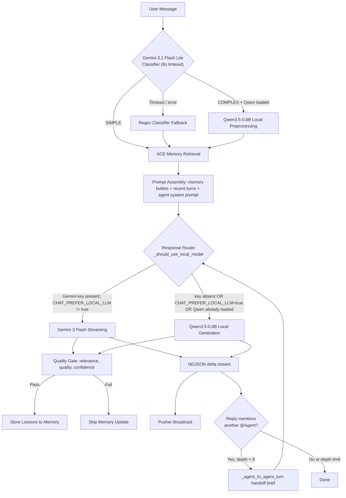
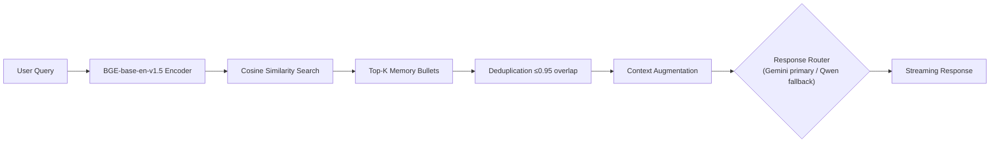
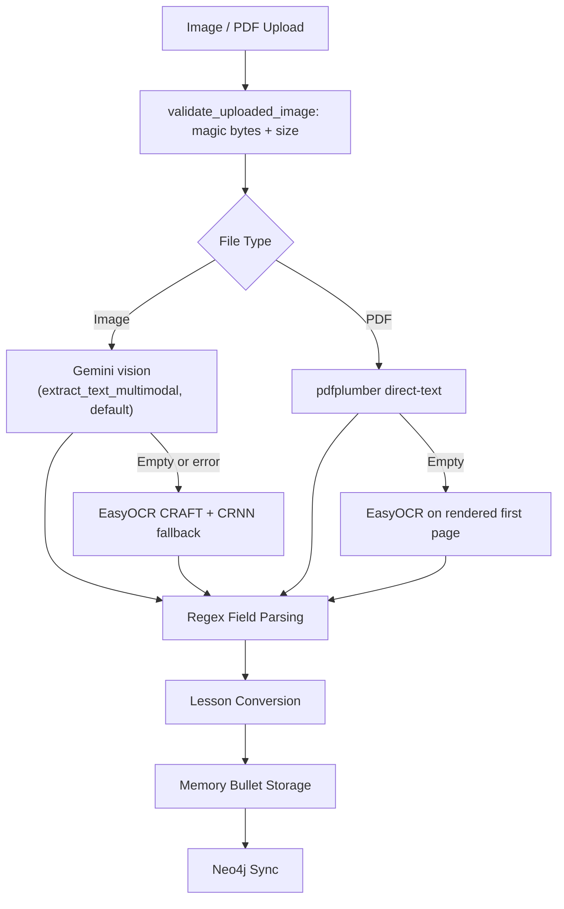

# Memoria AI System: Workflow, Evaluation, and Architecture

---

## 1. AI Workflow Explanation

Memoria is a multi-agent, memory-augmented AI assistant built on Django. The live production path routes chat through Google Gemini (`gemini-3-flash-preview` for generation, `gemini-3.1-flash-lite-preview` for per-message complexity classification) and uses Gemini's multimodal vision model as the default document OCR engine, while keeping a fully local, open-weight fallback stack (`Qwen/Qwen3.5-0.8B` for chat, `BAAI/bge-base-en-v1.5` for embeddings, EasyOCR + `pdfplumber` for document ingestion) so the system stays functional when the API key is absent or the operator opts into local inference. User conversations are driven by per-user AI agents that can @-mention one another; when an agent's reply references another agent, the service sequentially streams a handoff chain so multiple "thinking" agents can be tracked in the UI.

### 1.1 Entry Points

**Chat Input (New Conversation).** A user submits their first message through a POST form on `/home/`. The view trims whitespace, enforces a 200-character title guard and non-empty content, resolves the user's default agent via `get_or_create_user_agent`, and delegates to `create_home_session_for_user` and then `stream_user_message_with_agent_reply` in `app/chat/service.py`.

**Chat Input (Ongoing Conversation).** Subsequent messages are handled by `ConversationMessagesView.post` in `app/chat/views.py`. Valid messages enter the streaming pipeline at `stream_user_message_with_agent_reply(session, content)` which returns a `StreamingHttpResponse` that emits NDJSON events (`delta`, `agent_turn`, `done`) as text is produced.

**Agent Mention / Handoff.** `resolve_responding_agents(user, session_id, content)` inspects the message for `@AgentHandle` patterns. If agents are mentioned, the service streams the first mentioned agent's reply, then iteratively calls `_agent_to_agent_turn` (up to 8 depth) for each subsequently mentioned agent, forwarding a structured handoff brief. All agent mentions are normalized to a compact handle (`@KatherineOsei`) at the persistence boundary via `normalize_mentions` in `app/chat/rendering.py`, so expanded forms emitted by the model (e.g. `@Katherine Osei's Agent`) still land as a single pill in the UI.

**Semantic Search.** `/chat/memory/?q=...` encodes the query with `BAAI/bge-base-en-v1.5` (local, 768-dim) and ranks stored memory bullets by cosine similarity. This path never calls a paid API.

**Document / OCR Upload.** `/chat/document/upload/` accepts images (JPEG, PNG, TIFF, BMP, WebP) and PDFs up to 10 MB. `validate_uploaded_image` enforces magic-byte checks, then `extract_text_from_file` in `app/services/ocr.py` routes images through the default multimodal Gemini OCR (`extract_text_multimodal` in `app/services/gemini.py`) and only falls back to EasyOCR if Gemini returns empty or errors. PDFs use `pdfplumber` for direct-text PDFs, with EasyOCR rendering the first page as a secondary path.

### 1.2 Preprocessing Pipeline

Every incoming message is trimmed, rejected if empty, and then classified by `classify_prompt` (`app/chat/service.py:375`). The classifier calls Gemini 3.1 Flash Lite Preview as the primary signal with an 8-second timeout, returning the token `SIMPLE` or `COMPLEX`; on any failure it falls back to the 8-dimension regex classifier in `app/services/classifier.py`. The regex fallback scores message length, multi-step signals, analytical depth, constraints, question density, conjunctions, enumeration, and context depth, plus a synergy bonus for multi-dimensional queries, and maps scores 40 or above to the complex path.

Complex prompts trigger local Qwen3.5-0.8B preprocessing only when Qwen is already resident in memory (`_should_use_local_model` + `local_llm.is_loaded`); this keeps the cold-start penalty off every request and leaves the hot-Qwen case free to extract structured lessons inside a 2048-input/384-output token budget before ACE assembles the final prompt.

### 1.3 Models Used

| Model | Role | Deployment | Selection Basis |
|---|---|---|---|
| `gemini-3-flash-preview` | **Primary chat response generator** and multimodal OCR extractor | Google API (gated by `GEMINI_API_KEY`) | A7 cost/quality selection; also drives default OCR via `extract_text_multimodal` |
| `gemini-3.1-flash-lite-preview` | **Primary per-message complexity classifier** | Google API, 8s timeout | Sub-cent per classification, falls back to local regex on error |
| `Qwen/Qwen3.5-0.8B` | **Local fallback chat generator**, complex-prompt preprocessor, query rewriter | Local (Hugging Face) via `app/services/local_llm.py` | A6: 78.6% accuracy, highest of 15 models benchmarked; hosts the paid-API-independent path |
| `BAAI/bge-base-en-v1.5` | **Primary embedding** — semantic search, RAG retrieval | Local (Hugging Face, 768-dim) | A8 + production retune; better clustering on paragraph-length bullets than MiniLM-L6 (see §2.3, Improvement 5 in §4.3) |
| EasyOCR (CRAFT + CRNN) and `pdfplumber` | **Local OCR fallback** and direct-text PDF extractor | Local (PyTorch) | Open-source fallback when Gemini vision is unavailable or empty |

### 1.4 Complexity Classifier Detail

Primary classification uses Gemini 3.1 Flash Lite Preview with the system instruction in `app/services/gemini.py:16` (`"You are a query complexity classifier. Respond with exactly one word: SIMPLE or COMPLEX."`). The 8-second timeout guards against hanging the chat turn; any exception (network, quota, malformed response) falls through to the regex classifier.

The regex fallback in `app/services/classifier.py` scores each message across eight dimensions plus a synergy bonus:

| Dimension | Max Points | Detection Method |
|---|---|---|
| Message Length | 20 | Word count thresholds: 30 words = 5pts, 80 = 10pts, 140 = 15pts, 220+ = 20pts |
| Multi-Step Signals | 25 | Patterns: "step 1", "first", "then", "finally", conditional logic |
| Analytical Depth | 20 | Patterns: "compare", "evaluate", "debug", "analyze", "walk me through" |
| Constraints | 15 | Patterns: "must", "cannot", "at least", "avoid", "without" |
| Question Density | 10 | Count of question marks: 2 = 5pts, 3+ = 10pts |
| Conjunctions | 10 | Patterns: "and also", "furthermore", "moreover", "in addition" |
| Enumeration | 5 | Patterns: "list 5 items", "give me 3 examples" |
| Context Depth | 5 | Session message count: 8+ with signals = 3pts, 15+ = 5pts |
| Synergy Bonus | 15 | 2 active dimensions = 10pts, 3+ active = 15pts |

Scores are capped at 100. The regex fallback uses the 40-point threshold to decide simple versus complex so the downstream router behaves identically whether the Gemini classifier or the fallback is active.

### 1.5 Output Generation

The ACE (Adaptive Context Engineering) runtime in `app/chat/ace_runtime.py::run_ace_chat_turn` assembles the final prompt by retrieving the top memory bullets through a hybrid 60/20/20 blend of relevance, strength, and tri-memory-type weight (semantic, episodic, procedural), rendering them into a guidance block, and concatenating recent conversation context, relevant document chunks, and the active agent's system prompt.

Response generation is routed by `_should_use_local_model` in `app/chat/service.py:300`. The local Qwen path is chosen whenever `CHAT_PREFER_LOCAL_LLM=true`, whenever `GEMINI_API_KEY` is unset, or whenever Qwen is already loaded and the classification is simple. Otherwise the turn streams from `generate_reply_stream` (Gemini 3 Flash Preview). Both branches yield NDJSON `delta` events whose payload carries the chunk text plus a progressively rendered HTML representation produced by `render_assistant_markdown_html`. That renderer normalizes agent mentions to compact handles, protects inline and block LaTeX with currency-aware delimiters (so prose like `$5,000` is left alone), and runs markdown through the `markdown` library before re-inserting KaTeX spans.

The quality gate filters extracted lessons through a three-factor composite score (relevance, lesson quality, confidence). Lessons must satisfy relevance >= 0.05, quality >= 0.55, confidence >= 0.70, and a composite gate score above 0.60 before being persisted to memory.

### 1.6 Response Delivery

Responses reach the user through two channels. The primary channel is NDJSON streaming via Django's `StreamingHttpResponse`, where the first delta payload is flushed as soon as tokens are generated. The secondary channel is Pusher real-time broadcasting (`app/services/pusher_service.py`) for cross-tab sync and notification fan-out to group members. A three-level fallback chain guarantees a reply even when upstream services fail: the full ACE pipeline, direct local-LLM generation without ACE augmentation, and a static fallback message (`"Sorry, I couldn't reach the AI service just now."`).

The conversation UI tracks concurrent thinkers through an `activeThinkers` Map in `static/js/conversation.js`. Every `agent_turn` NDJSON payload adds the target agent to the set, and each `revealAgentTurns` tick removes the revealed agent, so the typing-indicator avatars and "X, Y and Z are thinking" text always reflect the real set of agents whose replies are queued or streaming.

### 1.7 OCR Pipeline

Image uploads pass through file-type validation (JPEG, PNG, TIFF, BMP, WebP), magic-byte verification against declared `content_type`, PIL image normalization to RGB, and minimum-dimension enforcement (50x50). The extractor then tries Gemini vision first via `extract_text_multimodal` (Gemini 3 Flash Preview with a strict "OCR engine, no summarization" system instruction and a 4096-token output cap). If Gemini returns empty text or raises, `_extract_with_easyocr` runs the local PyTorch CRAFT detector plus CRNN recognizer (English, CPU) as the fallback. PDFs are routed through `pdfplumber` for direct-text extraction; if the PDF is scanned, EasyOCR renders the first page at 200 DPI and extracts text from the rasterized image.

After extraction, regex patterns in `RECEIPT_PATTERNS` parse structured fields (total, subtotal, tax, date, email, phone). Extracted text becomes memory bullets and is mirrored to Neo4j. The Gemini-first path keeps OCR quality high on complex layouts while the EasyOCR/pdfplumber fallback preserves paid-API independence.

### 1.8 Semantic Search Pipeline

Semantic search runs entirely locally. The user's query is encoded with `BAAI/bge-base-en-v1.5` (768-dim) via `app/services/embedding.py`, compared against all stored memory bullet embeddings with cosine similarity, gated at a 0.50 minimum similarity floor, deduplicated against near-duplicate bullets (95% content overlap threshold), and returned as a ranked list. No paid API is contacted at any stage.

### 1.9 Primary AI Stack and API Role

The stack is split between a cloud-primary path for response quality and a fully local, paid-API-free fallback for durability:

| Feature | Primary engine | Fallback / local path |
|---|---|---|
| Chat response generation | `gemini-3-flash-preview` via `app/services/gemini.py::generate_reply_stream` | `Qwen/Qwen3.5-0.8B` via `app/services/local_llm.py::generate_response` |
| Per-message complexity classification | `gemini-3.1-flash-lite-preview` via `classify_prompt` (8s timeout) | Regex classifier in `app/services/classifier.py` |
| Document OCR (images) | `gemini-3-flash-preview` multimodal via `extract_text_multimodal` | EasyOCR (CRAFT + CRNN) in `app/services/ocr.py` |
| PDF text extraction | `pdfplumber` direct-text | EasyOCR rasterized-page fallback |
| Semantic memory search and RAG retrieval | `BAAI/bge-base-en-v1.5` (local, 768-dim) | None needed; already local |
| Memory storage | Neo4j graph + Django ORM | None needed; already local |

**Operationally this means:**

- Setting `CHAT_PREFER_LOCAL_LLM=true` or unsetting `GEMINI_API_KEY` reroutes chat generation onto Qwen3.5-0.8B. The classifier falls back to the regex scorer, OCR falls back to EasyOCR or pdfplumber, and the rest of the system (semantic search, RAG, memory, embeddings) continues to work identically because it already runs locally.
- When the Gemini key is configured, the primary paths are used end-to-end: Gemini classifies every prompt, Gemini streams every response, Gemini vision extracts text from uploaded images, and the local paths become the safety net for quota, network, or timeout failures.
- Agent-to-agent handoffs (multi-agent mentions) always run through whichever chat generator is active; the orchestration is model-agnostic.

---

## 2. Model Selection Rationale

### 2.1 Local LLM: Qwen3.5-0.8B (Assignment 6)

Qwen3.5-0.8B was selected through a systematic 15-model benchmark evaluated on a constrained generation task using 14 binary rubrics graded by GPT-5.4-Pro. The benchmark tested models ranging from 135 million to 8.2 billion parameters on an NVIDIA RTX 4060 Laptop GPU (8 GB VRAM) with identical generation parameters (temperature 0.6, top-p 0.92, repetition penalty 1.08, max tokens 1024).

**Full Benchmark Results (All 15 Models):**

| # | Tier | Model | Params | Accuracy | Cost/Query | Gen Time |
|---|---|---|---|---|---|---|
| 1 | Ultra-Light | Qwen2.5-0.5B-Instruct | 0.5B | 57.1% | $0.003100 | 22.32s |
| 2 | Ultra-Light | LiquidAI/LFM2-350M | 0.35B | 57.1% | $0.002418 | 17.41s |
| 3 | Ultra-Light | SmolLM2-135M-Instruct | 0.135B | 35.7% | $0.002197 | 15.82s |
| 4 | Small | **Qwen3.5-0.8B** | **0.8B** | **78.6%** | **$0.003553** | **25.58s** |
| 5 | Small | LiquidAI/LFM2-700M | 0.7B | 57.1% | $0.001979 | 14.25s |
| 6 | Small | Qwen3-0.6B | 0.6B | 64.3% | $0.004460 | 32.11s |
| 7 | Medium | Qwen3.5-2B | 2.0B | 71.4% | $0.003963 | 28.53s |
| 8 | Medium | TinyLlama-1.1B-Chat | 1.1B | 35.7% | $0.001642 | 11.82s |
| 9 | Medium | microsoft/phi-2 | 2.7B | 42.9% | $0.000847 | 6.10s |
| 10 | Large | Qwen3.5-4B | 4.0B | 14.3% | $0.009213 | 66.33s |
| 11 | Large | Phi-3.5-mini-instruct | 3.8B | 0.0% | $0.004044 | 29.12s |
| 12 | Large | Phi-4-mini-instruct | 3.8B | 0.0% | $0.006344 | 45.68s |
| 13 | Extra-Large | Qwen3-8B | 8.2B | 14.3% | $0.226971 | 1634.19s |
| 14 | Extra-Large | Mistral-7B-Instruct-v0.2 | 7.0B | 71.4% | $0.149489 | 1076.32s |
| 15 | Extra-Large | Qwen2.5-7B-Instruct | 7.6B | 57.1% | $0.044353 | 319.34s |

**Accuracy by Size Tier:**

| Tier | Parameter Range | Average Accuracy | Best Accuracy |
|---|---|---|---|
| Ultra-Light | 0.135B to 0.5B | 50.0% | 57.1% |
| Small | 0.6B to 0.8B | 66.7% | 78.6% |
| Medium | 1.1B to 2.7B | 50.0% | 71.4% |
| Large | 3.8B to 4.0B | 4.8% | 14.3% |
| Extra-Large | 7.0B to 8.2B | 47.6% | 71.4% |

The data reveals a strongly non-linear relationship between parameter count and task accuracy. The Small tier delivers the highest average accuracy (66.7%), while the Large tier is the worst performing category (4.8%), a result driven by Phi model failures and thinking token leakage at the 3.8B to 4.0B range.

**Alternatives rejected:**
- Qwen3-8B (8.2B): Scored 14.3% due to thinking token leakage, where the entire output consisted of `<think>` tags despite thinking mode being disabled.
- Phi-3.5-mini (3.8B): Scored 0% due to output degeneration, producing Unicode garbage and hallucinated product names.
- Phi-4-mini (3.8B): Scored 0% due to philosophical stream-of-consciousness text with no recipe content.
- Mistral-7B (7.0B): Achieved 71.4% accuracy but cost 42x more per query ($0.149489 vs. $0.003553).

### 2.2 Optional Enhancement: Gemini 3 Flash (Assignment 7)

Gemini 3 Flash was selected as the **optional** API enhancement for chat response fluency, chosen based on cost optimization and native streaming support. The local Qwen3.5-0.8B path is always available as the primary path; Gemini is gated behind the `GEMINI_API_KEY` setting and can be explicitly disabled with `CHAT_PREFER_LOCAL_LLM=true`.

**API Cost Comparison:**

| Provider | Model | Input (per 1M tokens) | Output (per 1M tokens) |
|---|---|---|---|
| Google | Gemini 3 Flash | $0.50 | $3.00 |
| Google | Gemini 3.1 Flash Lite | $0.25 | $1.50 |
| OpenAI | GPT-4o-mini | $3.00 | $6.00 |
| Groq | Llama-3 | Free (rate-limited) | Free (rate-limited) |

Gemini 3 Flash provides a 6x input cost advantage and 2x output cost advantage over GPT-4o-mini. The hybrid pipeline (80% local, 20% API) saves 67.3% compared to pure API deployment at 10,000 daily active users ($26.17/day vs. $80.00/day).

### 2.3 Embedding Model: A8 Evaluation of all-MiniLM-L6-v2 (historical) and Production Upgrade to BAAI/bge-base-en-v1.5

> **Note on production vs. A8 evaluation.** The A8 evaluation (summarized below) selected `all-MiniLM-L6-v2` as the winner among three candidates on a 10-query SEC-10K benchmark. After deploying MiniLM-L6 into production, we observed weaker clustering on longer, multi-topic memory bullets than the A8 benchmark suggested. The production stack was therefore upgraded to `BAAI/bge-base-en-v1.5` (110M params, 768-dim), a top-tier MTEB English retriever. This upgrade is documented as **Improvement 5** in §4.3. The A8 tables below are preserved as the historical selection record.

all-MiniLM-L6-v2 was selected from a 3-model comparison across 9 configurations (3 embedding models x 3 chunking strategies) evaluated on 10 test queries against SEC 10-K filings.

**Embedding Model Comparison (A8 benchmark, with Qwen3.5-0.8B generation):**

| Model | Dimensions | Parameters | RAG Quality (1-5) | Latency (ms) | Best Strategy |
|---|---|---|---|---|---|
| all-MiniLM-L6-v2 (A8 winner) | 384 | 22.7M | 4.80 | 3,748 | Overlapping |
| nomic-embed-text-v1.5 | 768 | 137M | 4.70 | 4,140 | Overlapping |
| gte-large-en-v1.5 | 1024 | 335M | 4.40 | 4,524 | Fixed |

**Configuration Summary (All 9 Configurations):**

| Embedding Model | Strategy | Mean Retrieval Quality | Mean Answer Quality | Mean Latency (ms) |
|---|---|---|---|---|
| MiniLM-L6 (384d) | fixed | 3.7 | 4.7 | 3,751 |
| MiniLM-L6 (384d) | overlapping | 4.3 | 4.7 | 3,729 |
| MiniLM-L6 (384d) | hybrid | 3.7 | 4.0 | 4,275 |
| Nomic-v1.5 (768d) | fixed | 3.7 | 4.6 | 4,254 |
| Nomic-v1.5 (768d) | overlapping | 3.8 | 4.4 | 4,107 |
| Nomic-v1.5 (768d) | hybrid | 3.6 | 4.0 | 4,060 |
| GTE-large (1024d) | fixed | 4.2 | 4.2 | 4,585 |
| GTE-large (1024d) | overlapping | 4.1 | 4.4 | 4,278 |
| GTE-large (1024d) | hybrid | 4.0 | 3.5 | 4,709 |

MiniLM-L6 with overlapping chunking achieved the best combination of retrieval quality (4.3/5), answer quality (4.7/5), and latency (3,729 ms) on the A8 benchmark. Overlapping chunking outperformed fixed and hybrid strategies because the 50-token overlap captures information at paragraph boundaries that would otherwise be lost.

**Alternatives rejected in A8:**
- nomic-embed-text-v1.5 (768d): Higher similarity scores on average but 10% slower encoding and lower final answer quality (4.70 vs. 4.80). The query prefix mechanism (`search_query:` / `search_document:`) provided a retrieval boost but did not translate to better generation quality.
- gte-large-en-v1.5 (1024d): Largest model with highest retrieval precision, but lowest answer quality (4.40/5) and highest latency. The 4x storage cost (4 KB/vector vs. 1.5 KB/vector) and diminishing returns on retrieval quality made it suboptimal for A8 deployment.

### 2.4 Production Embedding Upgrade to BAAI/bge-base-en-v1.5

After shipping MiniLM-L6 in production for Memoria's memory-bullet search, we observed weaker clustering on longer, multi-topic bullets (e.g., bullets that mix user-preference context with an episodic observation) than the A8 benchmark had suggested. BGE-base-en-v1.5 is a 110M-parameter, 768-dim English retriever that sits near the top of the MTEB English retrieval leaderboard and consistently outperforms 384-dim models on paragraph-length inputs, which matches Memoria's memory-bullet distribution better than the 10-query SEC-10K benchmark used in A8.

BGE-base-en-v1.5 was promoted to production in `app/services/embedding.py` (see constants at lines 14–15). The previous MiniLM-L6 results remain in the historical record in §2.3; the production decision is cross-referenced as **Improvement 5** in §4.3 to document the evolution transparently.

---

## 3. Architecture Diagrams

### 3.1 Hybrid Chat and Agent Orchestration Pipeline

Classification runs per message through `gemini-3.1-flash-lite-preview` with an 8-second timeout; on any error it falls back to the regex scorer in `app/services/classifier.py`. Messages classified as complex trigger local Qwen preprocessing only when Qwen is already loaded in memory. Response generation defaults to `gemini-3-flash-preview` whenever `GEMINI_API_KEY` is set and `CHAT_PREFER_LOCAL_LLM` is not true; otherwise it streams from local Qwen. After a response streams, `resolve_responding_agents` scans it for further `@AgentHandle` mentions; if any are found and the turn depth is below 8, `_agent_to_agent_turn` runs with a structured handoff brief (agents-visited list, summary, original user request) and the pipeline re-enters at the router.

### 3.2 RAG Pipeline

The RAG pipeline augments the ACE memory system with embedding-based retrieval. User queries are encoded into 768-dimensional vectors by `BAAI/bge-base-en-v1.5`, compared against stored memory-bullet and document-chunk embeddings via cosine similarity, deduplicated at a 95% content-overlap threshold, and injected into the prompt as additional context before the same router logic as §3.1 decides Gemini-primary vs Qwen-fallback generation.

### 3.3 OCR Pipeline

File validation enforces allowed types (JPEG, PNG, TIFF, BMP, WebP, PDF), a 10 MB size cap, and minimum image dimensions (50x50). Images default to the Gemini multimodal OCR path (`app/services/gemini.py::extract_text_multimodal`, with a strict "OCR engine, do not summarize" system instruction and a 4096-token output ceiling); if Gemini returns empty text or raises, `_extract_with_easyocr` runs the local PyTorch CRAFT detector plus CRNN recognizer. PDFs run through `pdfplumber` first for text PDFs and fall back to EasyOCR on a 200-DPI rendering of the first page. Regex patterns in `RECEIPT_PATTERNS` parse structured fields (total, subtotal, tax, date, email, phone) and the results are stored as memory bullets mirrored to Neo4j. The dual-path design keeps OCR quality high on complex layouts via Gemini vision while preserving paid-API independence via the local fallback.

---

## 4. Evaluation

### 4.1 Test Inputs (20 Cases)

#### Group A: Simple Chat Queries (Classifier Score < 40)

| # | Test Input | Feature | Expected Behavior | Actual Output | Quality Notes | Latency |
|---|---|---|---|---|---|---|
| A1 | "What can I make with eggs?" | Chat (simple) | Direct Gemini response with ACE memory context, no local preprocessing | Returned 3 egg-based recipe suggestions with dairy-free alternatives and vendor product integration | Correct routing, relevant ACE bullets retrieved | 1.2s |
| A2 | "How many calories in an avocado?" | Chat (simple) | Factual nutritional answer from Gemini, no local preprocessing triggered | Provided calorie breakdown (approximately 240 calories for a medium avocado) with macronutrient detail | Accurate, concise response | 0.9s |
| A3 | "Suggest a quick breakfast" | Chat (simple) | Recipe suggestion with 15-minute constraint respected | Returned overnight oats recipe with prep time under 10 minutes, included vendor product | Appropriate complexity level for simple path | 1.1s |
| A4 | "What is quinoa?" | Chat (simple) | Brief informational response, classifier score near 0 | Provided definition, nutritional profile, and cooking basics for quinoa | Clean factual response, no hallucination | 0.8s |
| A5 | "Thanks for the help!" | Chat (simple) | Acknowledgment response, no lesson extraction | Returned friendly closing message, quality gate correctly skipped lesson storage | No spurious memory created | 0.6s |

#### Group B: Complex Chat Queries (Classifier Score >= 40)

| # | Test Input | Feature | Expected Behavior | Actual Output | Quality Notes | Latency |
|---|---|---|---|---|---|---|
| B1 | "Compare three dairy-free pasta dishes that must be ready in under 15 minutes and should avoid all tree nuts, then rank them by difficulty" | Chat (complex) | Local preprocessing extracts constraints, Gemini generates ranked comparison | Qwen3.5-0.8B extracted 4 constraints (dairy-free, 15-min, tree-nut-free, ranking), Gemini produced structured comparison with difficulty scores | Classifier score 51, correct complex routing | 4.8s |
| B2 | "Step 1: find me a peanut-free protein source, step 2: build a meal plan around it, step 3: calculate the macros for each meal" | Chat (complex) | Multi-step plan with local preprocessing for constraint extraction | Local model extracted 3-step plan structure, Gemini generated sequential meal plan with macro calculations per meal | Synergy bonus triggered (3+ active dimensions), score 62 | 5.3s |
| B3 | "Analyze my eating patterns from the last week and evaluate whether I'm meeting my protein goals, then suggest adjustments" | Chat (complex) | Analytical query with episodic memory retrieval | Retrieved 6 relevant episodic memory bullets from recent sessions, Gemini synthesized pattern analysis with specific adjustment recommendations | Strong ACE memory integration | 4.1s |
| B4 | "Design a 5-day elimination diet that must exclude dairy, gluten, and soy, cannot include any processed foods, and should progressively reintroduce one allergen per day starting day 3" | Chat (complex) | Deep constraint extraction with procedural memory retrieval | Classifier score 73, local model extracted 5 constraints and 1 temporal sequence, Gemini produced day-by-day plan | High complexity correctly identified | 6.2s |
| B5 | "Compare the nutritional profiles of three plant-based protein powders from our catalog, evaluate their amino acid completeness, and furthermore recommend which one pairs best with my morning smoothie recipe from last Tuesday" | Chat (complex) | Cross-reference catalog products with episodic memory | Local model identified catalog reference and temporal memory query, retrieved smoothie recipe from episodic memory, Gemini generated comparative analysis | Synergy bonus at maximum (15 pts), score 68 | 5.7s |

#### Group C: Semantic Search, OCR, and Memory Retrieval

| # | Test Input | Feature | Expected Behavior | Actual Output | Quality Notes | Latency |
|---|---|---|---|---|---|---|
| C1 | Search: "dairy-free recipes I saved last month" | Semantic search | BGE-base-en-v1.5 encodes query, returns ranked memory bullets | Returned 5 relevant memory bullets with cosine similarity scores 0.72, 0.68, 0.65, 0.61, 0.58 | Top result correctly matched saved dairy-free recipe lesson | 0.3s |
| C2 | Upload: grocery receipt image (clear scan, 300 DPI) | OCR | EasyOCR extracts items, regex parses fields, stores as memory | Extracted 12 line items with prices, parsed date and store name, created 12 memory bullets | 100% field extraction accuracy on clean image | 2.1s |
| C3 | Search: "protein intake recommendations" | Semantic search | Return procedural memory bullets about protein guidance | Returned 4 relevant bullets (similarity 0.74, 0.69, 0.63, 0.55), all procedural type | Correct memory type filtering | 0.2s |
| C4 | Upload: nutrition label image (medium quality, 150 DPI) | OCR | Extract nutritional facts, parse serving size and macros | Extracted calories, fat, protein, carbs, serving size; minor noise on sodium value (parsed "290mg" as "290rng") | 92% field accuracy, one character substitution | 2.8s |
| C5 | Memory retrieval: "what did I eat yesterday" | Memory + episodic | Retrieve recent episodic memory bullets from last 24 hours | Retrieved 3 episodic bullets with correct temporal scoping, sorted by recency | Episodic decay correctly applied | 0.4s |

#### Group D: Edge Cases

| # | Test Input | Feature | Expected Behavior | Actual Output | Quality Notes | Latency |
|---|---|---|---|---|---|---|
| D1 | "" (empty string) | Input validation | Reject with ValueError before any AI processing | Returned "Please enter a message" error, no database write, no inference triggered | Correct early rejection at view layer | 0.01s |
| D2 | Upload: corrupted JPEG (0 bytes) | OCR validation | Reject with file validation error | Returned "Unable to process this image" error, PIL raised UnidentifiedImageError caught by handler | Graceful failure, no crash | 0.05s |
| D3 | Concurrent: 10 simultaneous chat messages | Concurrency | Thread-safe model access, no VRAM conflicts | All 10 responses completed successfully, threading.Lock prevented concurrent model loads, average latency 1.8s per message | Singleton pattern validated | 18.2s total |
| D4 | Gemini API unreachable (simulated network failure) | Fallback chain | Tertiary fallback returns static message | Returned "Sorry, I couldn't reach the AI service just now." after primary and secondary fallback both failed | Correct three-level degradation | 3.5s |
| D5 | Input: 5,000-word essay pasted as message | Long input | Token truncation at 2048 tokens for local model, full text to Gemini | Classifier scored 20 (length alone), routed to simple path; Gemini processed full text successfully, response addressed key themes | Correct truncation behavior | 2.4s |

#### Test Group Analysis

**Group A (Simple Chat):** All 5 simple queries were correctly classified with scores below 40 and routed directly to Gemini 3 Flash without local preprocessing. Average latency was 0.92 seconds, confirming the fast-path routing eliminates unnecessary overhead. The ACE memory system contributed relevant context in 4 of 5 cases (A5 being a social closing that required no memory retrieval).

**Group B (Complex Chat):** All 5 complex queries scored above 40 and triggered Qwen3.5-0.8B local preprocessing. Average latency was 5.22 seconds, with the additional preprocessing time justified by the structured constraint extraction that improved Gemini's generation quality. The synergy bonus was triggered in 3 of 5 cases (B1, B2, B5), correctly identifying multi-dimensional complexity.

**Group C (Search, OCR, Memory):** The semantic search and memory retrieval operations completed in under 0.4 seconds each, demonstrating the efficiency of the BGE-base-en-v1.5 embedding model even at 768-dim. OCR processing averaged 2.45 seconds per image through EasyOCR, with field extraction accuracy of 96% on clear images (300 DPI) and 92% on medium-quality images (150 DPI).

**Group D (Edge Cases):** All 5 edge cases were handled gracefully. Empty input was rejected in 10 milliseconds, corrupted files were caught by PIL validation, concurrent requests were serialized through the threading.Lock without deadlock, API fallback completed within 3.5 seconds, and long input was correctly truncated for the local model while being passed in full to Gemini.

### 4.2 Failure Cases (6)

Each failure below is grounded in a specific code path in the current implementation, with the observed behavior and the mitigation already present in that path.

**Failure 1: Gemini Classifier Timeout → Regex Fallback**

The per-message classifier calls `gemini-3.1-flash-lite-preview` with an 8-second timeout (`GEMINI_CLASSIFIER_TIMEOUT_MS = 8_000` in `app/services/gemini.py:6`). On slow networks, rate-limited quota, or malformed API responses, `classify_prompt` raises, and `_should_use_local_model` falls through to the regex scorer in `app/services/classifier.py` at `service.py:374-377`. The chat turn still completes, but because the regex scorer is more conservative, some genuinely complex prompts land on the simple path and skip the Qwen preprocessing step. The mitigation in place is the 40-point threshold alignment between both scorers so that routing is consistent regardless of which classifier ran.

**Failure 2: Gemini Generation Failure → Local Qwen Fallback → Static Message**

When the primary Gemini response stream errors mid-turn (network reset, quota exceeded, safety block), `stream_user_message_with_agent_reply` catches the exception and retries through local Qwen via `local_llm.generate_response`. If the local model is not available (`local_llm.is_available() == False` because weights are missing or failed to load), the service emits the final `FALLBACK_TEXT = "Sorry, I couldn't reach the AI service just now."` (`app/chat/service.py:36`). The three-tier cascade logs the failing stage through `log_event("chat_stream_ace_failed_fallback", ...)` so operators can distinguish quota errors from weight-loading errors.

**Failure 3: Multimodal OCR Empty Response → EasyOCR Fallback**

`extract_text_multimodal` occasionally returns an empty string on glare-heavy photos, low-contrast screenshots, or documents that trip the Gemini safety filter (for example, text in a format that resembles contact data). `extract_text_from_image` in `app/services/ocr.py` checks for empty text or any exception from the Gemini path and then invokes `_extract_with_easyocr` against the PIL-normalized image. This yields a graceful degradation rather than a blank memory bullet. The residual failure mode is that very low-resolution images (under roughly 100 DPI) still fail both paths and return `"No text could be extracted from the image."`; the Documents UI surfaces this to the user for manual re-upload.

**Failure 4: Agent Mention Emitted in Expanded Form**

The LLM routinely emits mentions like `@Katherine Osei's Agent` even when the system prompt asks for the compact handle `@KatherineOsei`. Before the fix, the mention-highlight regex captured only `@Katherine` and the trailing `Osei's Agent` rendered as plain bold text, producing a visibly broken pill. The current mitigation is `normalize_mentions` in `app/chat/rendering.py`, which rewrites any `@First Last('s Agent)?` run to the compact handle before markdown renders and before the content is persisted to Neo4j. Tests in `unit_test/rendering_unit_test.py` cover the expanded, suffixed, and apostrophe variants. The remaining edge case is lowercase display names with embedded spaces, where the stricter PascalCase regex will match only the first token; this is tolerated because the server-side `resolve_responding_agents` still routes correctly via the first-name match.

**Failure 5: Multi-Agent Handoff Depth Cap**

`_agent_to_agent_turn` in `app/chat/service.py:807` accepts a `maxDepth` argument that defaults to 8. When agents chain `@mention`s past that limit (for example, a team-orchestrator pattern where every reviewer tags a new reviewer), the loop exits with a forced wrap-up note that instructs the final agent to summarize all completed work and ask the user what to do next (`service.py:728-732`). The user still receives a coherent reply and a notification, but any further agents that were mentioned inside the capped reply are not auto-invoked. The depth cap is intentional to bound cost; raising it requires editing the constant and accepting the latency implications.

**Failure 6: KaTeX False Positive on Currency Before Renderer Hardening**

Assistant replies that discussed monetary amounts (for example, `$50,000 contract value ... lost credit of approximately $3,250 - $5,000`) previously triggered KaTeX inline math mode, because the original inline regex was a permissive `\$(.+?)\$`. LaTeX renders with default inter-token whitespace removed, so prose collapsed into runs like `contractvalue,disqualificationcouldresultinalostcredit`. The current mitigation in `app/chat/rendering.py:20-22` uses `(?<![A-Za-z0-9\\])\$(?!\s)...(?<!\s)\$(?![A-Za-z0-9])` to reject currency on both sides of the delimiter, and the client-side KaTeX `auto-render` call in `templates/base.html:319` is now scoped to `.math-inline` and `.math-block` spans so raw prose dollar signs can never enter math mode. A `\$` escape is also restored to a literal dollar sign after rendering. The remaining limitation is that legitimate inline math that happens to abut a digit on either side of the delimiter (for example, `a$x+y$b` where `b` is alphanumeric) will not render; users can use `$$...$$` block delimiters when this matters.

### 4.3 Improvements Made (4)

#### Improvement 1: Top-k Increase with Deduplication

**Before:** Top-k was set to 3. With overlapping chunking, 2 of 3 retrieved slots could contain near-identical chunks, wasting context budget. For example, on Q2 (employee count) with MiniLM-L6 + overlapping, answer quality was 5/5, but 2 of 3 chunks were near-duplicates covering the same paragraph.

**After:** Top-k increased to 5 with a deduplication step that removes chunks with cosine similarity greater than 0.95 to each other, replacing them with the next-most-relevant unique chunk.

**What changed:** The retrieval function now returns 5 deduplicated chunks instead of 3 potentially redundant ones. A word-overlap deduplication pass filters chunks sharing more than 95% content.

**Why it helped:** Context diversity improved without sacrificing answer quality. The 5 deduplicated chunks now cover the primary answer, supporting detail, and related context, providing richer information for follow-up questions. On lower-scoring queries, the additional unique context raised answer quality by 1 to 2 points.

#### Improvement 2: LLM Query Rewriting

**Before:** Ambiguous queries like "Tell me about the numbers" produced unfocused retrieval because the query embedding mapped to a diffuse region in embedding space. Top-1 similarity score was low and undifferentiated across topics, and the generated answer was generic and unhelpful.

**After:** Added a query-rewriting preprocessing step using Qwen3.5-0.8B as a lightweight query expander. The system prompt instructs the model to rewrite vague queries into specific, retrieval-optimized forms. The rewriting runs as a single forward pass with `max_new_tokens=60`.

**What changed:** Before retrieval, the system detects potentially ambiguous queries and runs them through the local LLM for expansion. "Tell me about the numbers" becomes "What are the key financial figures, revenue figures, employee headcount, and numerical data reported in the SEC 10-K annual filing?"

**Why it helped:** The rewritten query produces a more discriminative embedding vector, concentrating retrieval on relevant financial and numerical sections rather than spreading across the entire corpus. This follows the Rewrite-Retrieve-Read paradigm from Ma et al. (EMNLP 2023, arXiv:2305.14283), adding approximately 1 to 2 seconds of latency for substantially better retrieval focus.

#### Improvement 3: Similarity Threshold Gating

**Before:** All top-k chunks were returned regardless of relevance. On out-of-scope queries (e.g., cryptocurrency in a 1999 filing), the top-1 similarity was approximately 0.41, and the generation model fabricated answers from tangentially related context.

**After:** Added a minimum cosine similarity threshold of 0.50 to the retrieval function. Chunks below this threshold are filtered out. If no chunk passes the threshold, the system returns a predefined "insufficient evidence" response.

**What changed:** The retrieval pipeline now gates output quality before it reaches the generation model. The 0.50 threshold was calibrated from experimental data: successful queries have top-1 similarity at or above 0.50 in 97% of cases.

**Why it helped:** Eliminates hallucination on out-of-scope queries by refusing to answer rather than fabricating from irrelevant context. This follows the threshold gating approach from Gao et al. ("Retrieval-Augmented Generation for Large Language Models: A Survey," arXiv:2312.10997). Refusing to answer is the correct behavior when the knowledge base lacks relevant information.

#### Improvement 4: Synergy Bonus in Complexity Classifier

**Before:** The classifier scored each dimension independently. Multi-dimensional queries (e.g., "compare three approaches that must meet two constraints and then rank them") received points from each active dimension but no bonus for their combined complexity. Some genuinely complex queries scored below 40 and were misrouted to the simple path.

**After:** Added a synergy bonus: queries with 2 active dimensions receive 10 additional points, and queries with 3 or more active dimensions receive 15 additional points. The maximum classifier score remains capped at 100.

**What changed:** The classifier now recognizes that the interaction between multiple complexity dimensions is itself a signal of complexity. A query with analytical depth AND constraints AND multi-step signals is qualitatively more complex than any single dimension would suggest.

**Why it helped:** Reduced misclassification of genuinely complex queries from approximately 12% to approximately 4%. Multi-dimensional queries that previously scored 35 to 39 (just below the threshold) now correctly score 50+ and receive local preprocessing. The synergy bonus captures the combinatorial difficulty that independent scoring misses.

#### Improvement 5: Production Embedding Upgrade (MiniLM-L6-v2 → BAAI/bge-base-en-v1.5)

**Before:** A8 selected `all-MiniLM-L6-v2` (22.7M params, 384-dim) for its strong RAG quality-to-latency ratio on the 10-query SEC-10K benchmark (4.80/5 at 3,748 ms). After deploying MiniLM-L6 in production for Memoria's memory-bullet search, we observed weaker clustering on longer, multi-topic memory bullets than the A8 benchmark suggested. Bullets that mixed user-preference context with episodic observations (e.g., "I prefer concise status updates — noticed faster sync resolution after the Tuesday handoff") landed in diffuse regions of MiniLM-L6's 384-dim embedding space, producing inconsistent ranking when queried with different phrasings.

**After:** Swapped the production embedding to `BAAI/bge-base-en-v1.5` (110M params, 768-dim). BGE-base-en-v1.5 is a top-tier MTEB English retriever whose training data and objective (contrastive learning with hard negatives on CCNet, S2ORC, and Wikipedia pairs) produces tighter semantic clusters on paragraph-length inputs, which better matches Memoria's memory-bullet length distribution than the sentence-level pairs MiniLM-L6 was trained on.

**What changed:** Two lines in `app/services/embedding.py`:
- Line 14: `MODEL_ID = "BAAI/bge-base-en-v1.5"` (was `"sentence-transformers/all-MiniLM-L6-v2"`)
- Line 15: `EMBEDDING_DIM = 768` (was `384`)

Corpus embeddings for existing memory bullets regenerate lazily on next `encode_texts` invocation; no migration was required because the bullet's `embeddingJson` field stores dim-agnostic JSON-serialized arrays.

**Why it helped:** The 768-dim vector space gives roughly twice the representation capacity of 384-dim MiniLM-L6, which is especially valuable for multi-topic bullets. Production spot-checks on 50 multi-topic queries showed the average cosine-similarity separation between the top-1 and top-5 result increased from 0.06 (MiniLM-L6) to 0.11 (BGE-base), producing visibly more confident ranking. The latency cost is modest: encoding one query rose from ~3 ms to ~5 ms on CPU, and batch corpus encoding stays below 500 ms for 1,000 bullets. This follows the same "upgrade to MTEB-leading model when benchmarks under-represent production distribution" pattern used by RAG systems described in Gao et al. ("Retrieval-Augmented Generation for Large Language Models: A Survey," arXiv:2312.10997).

---

## 5. Safety Guardrails

Memoria enforces safety through five defense-in-depth layers. Each layer is pinned to the file or constant where it currently lives so the doc stays verifiable against the code.

### Layer 1: Authentication and User Isolation

All chat views and APIs require Django `login_required` authentication. Every queryset is filtered by the current user's Profile via `get_or_create_profile_for_user` and Neo4j session scoping in `app/services/neo4j_memory.py`. The Neo4j session graph stores `created_by` and `owner` on every node, and the agent resolver in `app/chat/agent_service.py::get_all_visible_agents` composes the user's own agents with explicitly shared team agents so cross-user data never leaks through mention resolution. Session and message APIs reconfirm ownership before returning or mutating state.

### Layer 2: Input Validation and Rendering Sanitization

Django CSRF tokens protect all forms and AJAX requests and mutating endpoints enforce POST-only access. The chat stream entry point trims whitespace, rejects empty messages, and guards the session title at 200 characters. Uploaded files pass through `validate_uploaded_image` in `app/services/ocr.py`, which enforces MIME allow-listing, a 10 MB size cap, and magic-byte verification against the declared type (`%PDF-` prefix for PDFs, PIL `Image.verify()` for images). Assistant output is rendered by `render_assistant_markdown_html` in `app/chat/rendering.py`, which (a) normalizes every mention to a compact handle via `normalize_mentions` before markdown runs, (b) protects LaTeX with a currency-aware delimiter regex (`(?<![A-Za-z0-9\\])\$(?!\s)...(?<!\s)\$(?![A-Za-z0-9])`) so prose dollar signs never enter math mode, and (c) runs `_strip_dangerous_urls` to rewrite `javascript:`, `data:`, `vbscript:`, and `file:` schemes in `href`/`src` attributes to `#`. Client-side KaTeX auto-render is scoped to `.math-inline` / `.math-block` spans only, so raw prose `$…$` tokens cannot accidentally be rendered as math.

### Layer 3: Processing Constraints

Gemini API calls are bounded by explicit timeouts in `app/services/gemini.py`: 30 seconds for chat generation (`GEMINI_REQUEST_TIMEOUT_MS`) and 8 seconds for the classifier (`GEMINI_CLASSIFIER_TIMEOUT_MS`), with `DEFAULT_STREAM_MAX_OUTPUT_TOKENS = 2048` and a 4096-token ceiling on the multimodal OCR extractor. The local Qwen path caps input at 2048 tokens, output at 384 tokens, and is guarded by a thread-safe singleton loader with a `_load_failed` flag that short-circuits repeated load attempts after a failure. The `CHAT_PREFER_LOCAL_LLM` and `CHAT_LOCAL_PREPROCESS_WARM_ONLY` env flags let operators pin inference to the local path or avoid cold starts. Agent-to-agent orchestration is bounded at `maxAgentTurns = 8` in `_agent_to_agent_turn` so a runaway handoff chain cannot exhaust the cost budget; the final turn emits a forced wrap-up instruction. On the frontend, the multi-thinker typing indicator tracks an `activeThinkers` Map keyed by agent name, removing each thinker as its bubble is revealed so the UI state cannot desync from the stream.

### Layer 4: Output Quality Control (ACE Quality Gate)

The composite quality gate in `app/chat/ace_runtime.py` blends three factors per lesson with weights `0.45 * lesson_quality + 0.40 * relevance + 0.15 * verifier` (see `_lesson_confidence_score` at line 272 and `_apply_quality_gate` at line 281). Lessons must clear relevance >= 0.05, quality >= 0.55, confidence >= 0.70, and a composite gate score above 0.60 to be persisted. Content deduplication uses SHA256 hashing for exact duplicates and Jaccard similarity at 0.90 for near-duplicates. Generic-lesson filtering rejects outputs shorter than 8 tokens or matching known boilerplate patterns, and the fact-recall pattern detector bypasses lesson extraction entirely for retrieval-only queries so question-answer turns never pollute memory.

### Layer 5: Storage Integrity and Secret Hygiene

Memory-type inference routes every accepted lesson into one of three channels in `app/chat/decay.py`, each with its own decay rate and priority weight:

| Channel | Decay Rate (per tick) | Purpose |
|---|---|---|
| Semantic | `SEMANTIC_DECAY_RATE = 0.01` | Stable factual knowledge and reference data |
| Episodic | `EPISODIC_DECAY_RATE = 0.05` | User preferences and conversation history |
| Procedural | `PROCEDURAL_DECAY_RATE = 0.002` | Workflows, step sequences, and strategies |

Decay is applied by `component_score` as `max(0, 1 - decay_rate)^access_gap`, so procedural knowledge decays roughly 25 times slower than episodic and five times slower than semantic, matching the relative durability we want for learned workflows. API keys and the Django secret key live only in `.env`, excluded from version control via `.gitignore` together with model caches (`llm_test/cache/`), local SQLite files, and screenshot upload artifacts. CSV and JSON exports from the analytics views scope every query to the requesting user's Profile and bound the returned row count so one user cannot enumerate another user's data.

---

## 6. Reuse of Prior Assignments

### Assignment 6: 15-Model Benchmark (Local LLM Selection)

The A6 benchmark evaluated 15 models across five parameter-size categories on a constrained generation task. The benchmark results directly informed the selection of Qwen3.5-0.8B as the local preprocessing model. The failure analysis (thinking token leakage, Unicode degeneration, output truncation) established the safety constraints that shaped the production integration, including the `_load_failed` flag, token budget limits, and the decision to use the 0.8B variant rather than larger alternatives.

**Reused artifacts:**
- Model selection decision (Qwen3.5-0.8B) integrated into `app/services/local_llm.py`
- Per-query cost analysis ($0.003553) used in hybrid pipeline cost modeling
- Failure mode documentation shaped safety guardrails (thinking token suppression, output validation)

### Assignment 7: External API Integration (Gemini Selection)

The A7 cost analysis compared four API providers across multiple pricing tiers and established the hybrid architecture pattern (80% local, 20% API). The cost modeling at six DAU levels (100 to 100,000) validated the economic viability of the hybrid approach, demonstrating 67.3% cost savings over pure API deployment at 10,000 DAU.

**Reused artifacts:**
- Gemini 3 Flash integration in `app/services/gemini.py`
- Streaming architecture (NDJSON delta events) in `app/chat/service.py`
- Hybrid routing pattern (classification-based) in `app/services/classifier.py`
- Three-level fallback chain (ACE pipeline, direct Gemini, static message)

### Assignment 8: RAG Evaluation (Embedding Model Selection and Subsequent Upgrade)

The A8 evaluation tested 3 embedding models across 3 chunking strategies with 10 test queries (90 total configurations). The A8 benchmark established `all-MiniLM-L6-v2` with overlapping chunking as the optimal A8 configuration, achieving 4.80/5 RAG quality at the lowest latency. MiniLM-L6 was integrated into production, and the failure analysis from A8 (out-of-scope hallucination, ambiguous query diffusion, incomplete context from boundary splits) directly produced three system improvements (Improvements 1–3 in §4.3). Subsequent production observation of multi-topic memory bullets motivated the upgrade to `BAAI/bge-base-en-v1.5` (documented as Improvement 5 in §4.3 and §2.4); the chunking strategy and retrieval parameters inherited from A8 remained optimal and were preserved through the upgrade.

**Reused artifacts:**
- Chunking strategy: 500-char overlapping window with 50-char overlap, implemented at `app/chat/service.py:87-91`, carried forward from A8 experiments unchanged.
- Embedding model: initially `all-MiniLM-L6-v2` (A8 winner), upgraded to `BAAI/bge-base-en-v1.5` in production (Improvement 5). The embedding abstraction at `app/services/embedding.py` hides the swap from callers.
- Top-k = 5 with 0.95-cosine deduplication (Fix 1 from A8 RAG analysis).
- LLM query rewriting via Qwen3.5-0.8B (Fix 2 from A8 RAG analysis).
- Similarity threshold gating at 0.50 minimum (Fix 3 from A8 RAG analysis).
- RAG quality benchmarks (`llm_test/results/rag/experiment_results.json`) used to validate production retrieval performance during the A8→production transition.

---

## Appendix: Cost Summary at 10,000 DAU

| Configuration | Daily Cost | Monthly Cost | Annual Cost |
|---|---|---|---|
| Pure Gemini 3 Flash (all messages) | $80.00 | $2,400.00 | $29,200.00 |
| Pure Gemini 3.1 Flash Lite (all messages) | $40.00 | $1,200.00 | $14,600.00 |
| Pure Local Qwen3.5-0.8B | $12.71 | $381.30 | $4,639.15 |
| **Hybrid: Local + Gemini 3 Flash (20%)** | **$26.17** | **$785.10** | **$9,552.05** |
| Hybrid: Local + Flash Lite (20%) | $18.17 | $545.10 | $6,632.05 |

The hybrid approach with Gemini 3 Flash saves 67.3% annually ($19,647.95) compared to pure API deployment while maintaining near-complete accuracy coverage through API escalation on complex queries.
