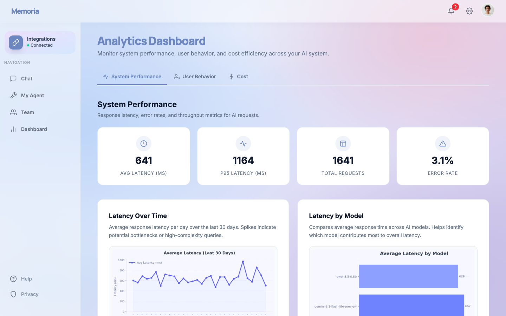
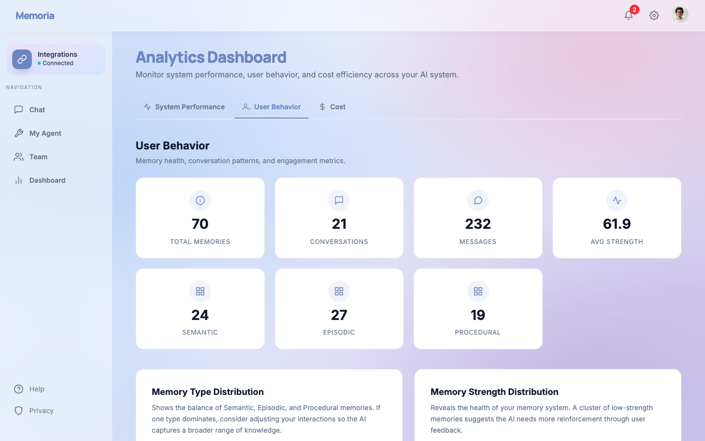
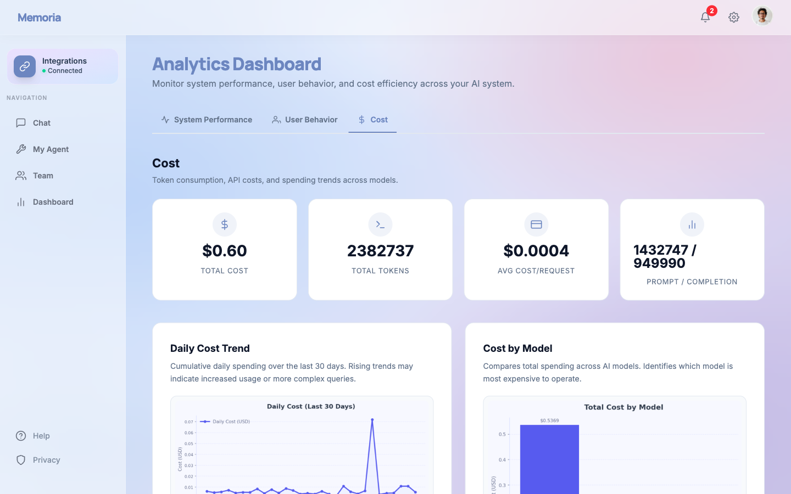

# Analytics Dashboard — Memoria

**Live dashboard:** <https://mira-ydqq.onrender.com/chat/analytics/>
**Test login:** email `mohitg2@example.com` / password `uiuc12345`
**Snapshot:** 2026-04-17 — 1,641 requests, 70 memory bullets, and $0.5967 in total spend across 90 days.

## Part 1 — Analytics Design

### 1.1 Ten analytics questions across three categories

**A — System Performance**

- A1. How does end-to-end latency vary across requests over a rolling 30-day window?
- A2. Which model contributes the most to overall response time?
- A3. What fraction of requests fail or fall back, and does that pattern correlate with traffic spikes?

**B — User Behavior**

- B1. How is the memory store distributed across semantic, episodic, and procedural types?
- B2. How active is each user across days, weeks, and months?
- B3. What is the strength distribution of stored memory bullets, and what fraction sits below 50?

**C — Cost**

- C1. What is the average cost per request, and how does it change day over day?
- C2. Which model accounts for the largest share of spend, and is that share proportional to the value it produces?
- C3. What is the prompt-versus-completion token split, and how does that ratio shift over time?
- C4. What is the projected monthly spend at current usage?

### 1.2 Widget design plan (question → widget → data)

| Q | Widget | Type | Data |
|---|---|---|---|
| A1 | Latency Over Time with Avg Latency, P95 Latency, Total Requests, and Error Rate KPIs | Line chart with 4 KPI cards | Daily mean of `RequestLog.latencyMs` |
| A2 | Latency by Model | Bar chart | Mean of `RequestLog.latencyMs` grouped by `modelName` |
| A3 | Request Status Distribution with status breakdown table | Pie chart with data table | Count of `RequestLog.status` values |
| B1 | Memory Type Distribution with Semantic, Episodic, and Procedural KPIs | Pie chart with 3 KPI cards | Count of `MemoryBullet.memoryType` values |
| B2 | Conversation Activity with Conversations, Messages, and Avg Strength KPIs | Line chart with 3 KPI cards | Daily count of `Session` and `Message` nodes |
| B3 | Memory Strength Distribution with Avg Strength KPI | Bar chart with 1 KPI card | Histogram of `MemoryBullet.strength` across five ranges |
| C1 | Daily Cost Trend with Avg Cost per Request KPI | Area chart with 1 KPI card | Daily sum of `RequestLog.estimatedCostUsd` |
| C2 | Cost by Model with cost breakdown table | Bar chart with data table | Sum of `RequestLog.estimatedCostUsd` grouped by `modelName` |
| C3 | Token Usage Breakdown with Prompt and Completion KPIs | Stacked bar chart with 2 KPI cards | Daily sum of `RequestLog.promptTokens` and `RequestLog.completionTokens` |
| C4 | Total Cost and Total Tokens KPIs with 30-day trend line | 2 KPI cards with line chart | Cumulative sum of cost and tokens projected forward |

### 1.3 Statistical thinking

**Central tendency and dispersion.** We report both the mean latency and its 95th percentile because the mean alone hides the long tail that degrades user experience. The implementation sorts the latency series and indexes the 50th and 95th percentile elements, with the median also exposed through the JSON payload.

**Distributions across categorical and numeric axes.** The Memory Type and Request Status pie charts act as categorical histograms, while the Memory Strength bar chart bins a numeric variable across five strength ranges. Together these views reveal imbalance at a glance and inform concrete tuning decisions.

**Trends over time and group comparisons.** Latency Over Time, Conversation Activity, and Daily Cost Trend bucket events by day across a rolling 30-day window. Group comparisons across Latency by Model, Cost by Model, and Token Usage Breakdown identify which model or token category deviates from the rest.

## Part 2 — Dashboard Implementation

**Coverage.** The dashboard delivers 26 widgets across three categories (8 for System Performance, 10 for User Behavior, and 8 for Cost) using seven visualization types: KPI card, line chart, bar chart, stacked bar chart, area chart, pie chart, and data table.

**Data source.** Every chat turn records real telemetry. We measure latency with `time.monotonic()` and read prompt and completion token counts from the model response's `usage_metadata`, then persist a `(:RequestLog)` node to Neo4j. The management command `python manage.py seed_analytics --user mohitg2 --days 90` provisions the demo account and generates 90 days of weighted request logs.

**Authentication.** Every analytics view requires an authenticated session. Unauthenticated requests receive an HTTP 302 redirect to the login page.

### Dashboard screenshots (mohitg2, 2026-04-17)

### Submission metadata

| Field | Value |
|---|---|
| Live dashboard | <https://mira-ydqq.onrender.com/chat/analytics/> |
| Local dashboard | <http://127.0.0.1:8000/chat/analytics/> |
| Test login | email `mohitg2@example.com`, password `uiuc12345` |
| Sample JSON | `docs/07_api_demos/analytics_api_sample.json` |
| Screenshots | `docs/screenshots/analytics/{01,02,03}_*.png` |
